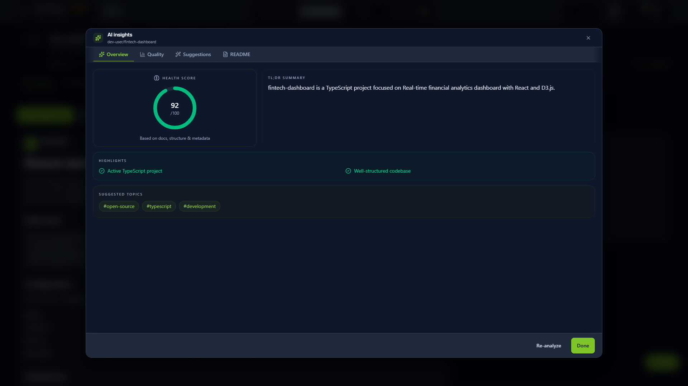
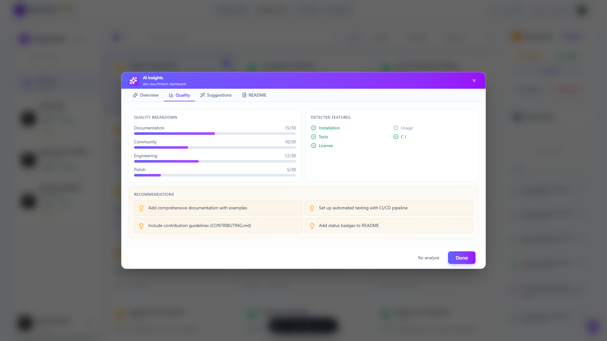
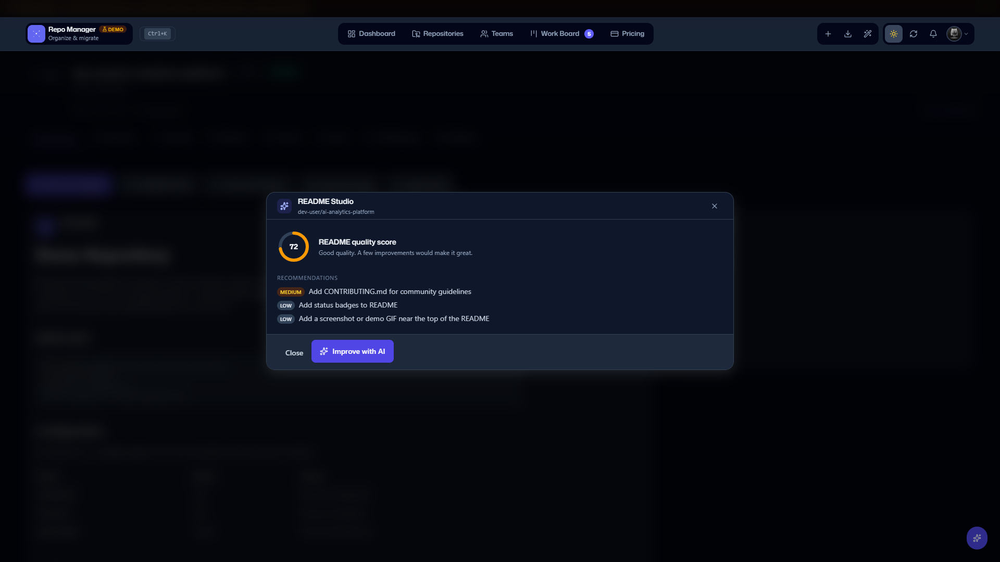
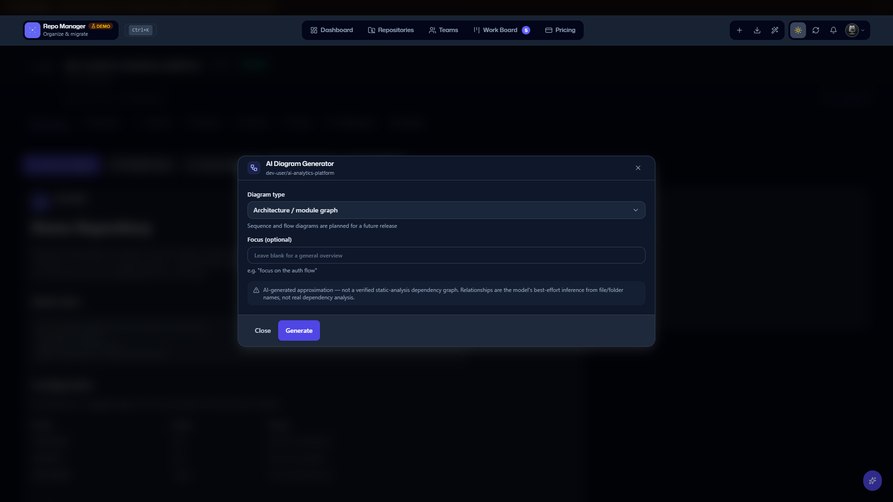
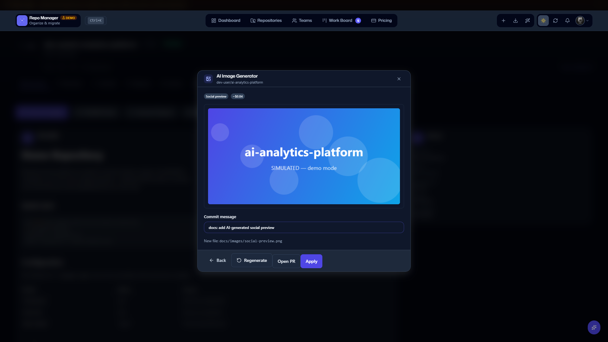
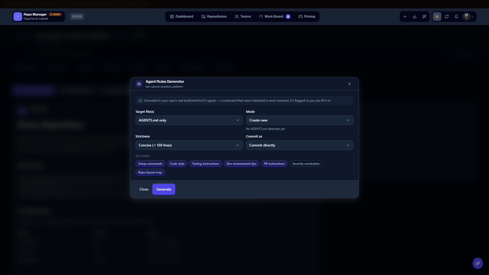

<div align="center">

<picture>
  <source media="(prefers-color-scheme: dark)" srcset="brand/mark-display-inverse.svg">
  
</picture>

# GitHub Repo Manager

**The GitHub dashboard that thinks — manage, migrate, and review repositories with metered, grounded AI.**

<picture>
  <source media="(prefers-color-scheme: dark)" srcset="docs/images/01_dashboard_dark_hd.png">
  
</picture>

<br>

[](https://github.com/brunobola-portfolio/GitHub-Repo-Manager/actions/workflows/ci.yml)


[](https://github.com/brunobola-portfolio/GitHub-Repo-Manager/releases)
[](https://github.com/brunobola-portfolio/GitHub-Repo-Manager/releases/latest)

**Free-first** (full AI surface + every Work Board tab + unlimited teams on Free) · **Self-hosting free forever** (Apache-2.0) · **Native on Windows**

[**Try the Demo**](#quick-start-demo-mode) · [Features](#features) · [Installation](#installation) · [Documentation](docs/index.md) · [Pricing](#plans--pricing) · [Download for Windows](https://github.com/brunobola-portfolio/GitHub-Repo-Manager/releases/latest) · [What's new in v4.24.3 — sign-in behind ARR](CHANGELOG.md#4243---2026-09-06)

<sub>Production-hardened — AES-256-GCM BYOK · rolling sessions + CSRF double-submit · GitHub API circuit breaker · SSRF + DNS-rebinding guard · dual-theme a11y gate.</sub>

</div>

---

## Table of Contents

- [Why GitHub Repo Manager?](#why-github-repo-manager)
- [Quick Start (Demo Mode)](#quick-start-demo-mode)
- [Features](#features)
  - [Dashboard & Live Inbox](#dashboard--live-inbox) · [Repositories & Bulk](#repositories--bulk-operations) · [Cross-Repo Work Board](#cross-repo-work-board) · [AI-Powered Intelligence](#ai-powered-intelligence)
- [Screenshots](#screenshots)
- [Plans & Pricing](#plans--pricing)
- [Azure DevOps Migration Suite](#azure-devops-migration-suite)
- [Architecture](#architecture)
- [Installation](#installation)
- [Configuration](#configuration)
- [Tech Stack](#tech-stack)
- [Documentation](#documentation)
- [Troubleshooting](#troubleshooting) · [FAQ](#faq) · [Roadmap](#roadmap)
- [Contributing](#contributing) · [License](#license)

---

## Why GitHub Repo Manager?

Managing a real GitHub estate means juggling several disconnected tools: dozens of repos across organizations, team permissions, CI/CD health, risk-aware PR review, and — when you're consolidating — a migration off Azure DevOps. That context-switching is where hours disappear.

**GitHub Repo Manager** puts it in one place:

- **One dashboard** for repos, teams, Actions analytics, and community health — with a personalised "what needs you" inbox.
- **Metered, grounded AI** you control — Bring Your Own Key (Anthropic · OpenAI · Gemini · OpenRouter · local), with per-feature monthly caps, an opt-in monthly $ spend cap, and answer-first, cited responses. No key? High-quality algorithmic fallbacks keep everything working.
- **A cross-repo Work Board** that surfaces reviews waiting on you, stale PRs, and tech debt across every repository — no manual registration.
- **AI Deep Review** that turns the in-app PR view into a tool you'd choose over github.com.
- **An Azure DevOps migration suite** (Git, TFVC, Boards, Wikis) with risk analysis, dry-run, and conflict resolution.
- **Native on Windows** — an installer or a portable ZIP, both with a bundled Node.js runtime: download, double-click, your browser opens. No Docker, no Node.js install, no admin rights. See [`docs/windows.md`](docs/windows.md).
- **Zero setup to try** — Demo Mode ships with 87 pre-loaded mock repositories.

> Built on React 19, Vite 8, Express 5, Tailwind CSS 4, and better-sqlite3 — self-hostable under Apache-2.0, with a free-first hosted plan.

---

## Quick Start (Demo Mode)

Try the full app instantly — **no API keys or GitHub account needed**.

```bash
git clone https://github.com/brunobola-portfolio/GitHub-Repo-Manager.git
cd GitHub-Repo-Manager
npm ci
npm run demo
```

Open **[http://localhost:5173](http://localhost:5173)**. No `.env`, no OAuth app, no keys: `npm run demo` switches the whole stack into the mock universe — **87 repositories**, organizations, teams, a live inbox and simulated AI — and signs you in as a demo user. Vite (:5173) proxies `/api` to Express (:3001). For real mode with your own GitHub account, see [Installation](#installation); `npm run dev:all` is the real-mode dev command and reads your `.env`.

> **On Windows?** Skip the toolchain — download from the [latest release](https://github.com/brunobola-portfolio/GitHub-Repo-Manager/releases/latest) and double-click **GitHub Repo Manager**.

---

## Features

### Dashboard & Live Inbox

<picture>
  <source media="(prefers-color-scheme: dark)" srcset="docs/images/15_dashboard_live_inbox_dark_hd.png">
  
</picture>

- **TodayPanel** — time-of-day greeting, org-filter and time-range chips that round-trip through the URL, and a "What needs you" grid (reviews waiting / stale PRs / open issues) with week-over-week deltas and a celebratory empty state.
- **Live Inbox** — a sectioned, actionable inbox (needs review · my open PRs · mentions · stale drafts). `j`/`k`/`Enter` to navigate rows, archive with `e`, snooze with `s`; state persists per-user and both actions are free. AI one-liners on the top items (BYOK). See the [Live Inbox guide](docs/features/dashboard-live-inbox.md).
- **Notification digest** (opt-in, off by default) — a daily or weekly e-mail summary of what's waiting, sent through the same Resend pipeline as the rest of the app's mail, with a signed one-click unsubscribe link. Skips entirely when e-mail isn't configured. Turn it on per-user in Settings.
- **Analytics** — real-time repo stats, 7/30/90-day activity trends, language distribution, and per-org insights.
- **GitHub Actions** — success/failure rates, duration analysis, daily trends, workflow triggering, and CSV export.
- **Community health** — a 0–100 score across documentation, standards, and activity, with priority-ranked recommendations.

### Repositories & Bulk Operations


- **Smart search & filters** — by name, language, visibility, type, or archived status. Search covers every page you've loaded, not just the one on screen — the empty state names what it searched and offers to load the rest. Filters and saved views round-trip through the URL, so a filtered view is bookmarkable and shareable by copy-pasting the link.
- **AI semantic search** — natural-language queries over your repos via real vector embeddings (cosine similarity).
- **Bulk actions** — archive, delete, transfer, or change visibility across many repos, behind a dry-run + confirmation-token safety flow.
- **Detailed repo view** — branches, PRs, issues, releases, Actions, and community health in one place.
- **AI insights** — quality reports with actionable, priority-ranked recommendations.

### Cross-Repo Work Board

A single cockpit across every repository — no context switching, no manual repo registration. Filters are URL-synced, so a filtered view is shareable by copy-pasting the link.

<picture>
  <source media="(prefers-color-scheme: dark)" srcset="docs/images/33_work_board_dark_hd.png">
  
</picture>

- **Tracked repos & discovery** — an explicit tracked set, auto-seeded from five signal collectors (review-requested, authored, assigned, owned, recently-committed). Pin / mute / untrack from anywhere; `Settings → Work Board` adds virtualised lists, bulk actions, and a "Discover now" panel.
- **KPI tiles & trends** — count-up animations, 7-day sparklines, and delta badges; snapshots persist via a daily sweeper.
- **Tabs** — My Reviews · My Issues · Stale PRs · Review Load · Tech Debt · **DORA Metrics** (deploy frequency, lead-time p50/p90, change failure rate, MTTR p50/p90, CSV export). Every tab is available on all tiers.
- **Inline actions** — approve / request-changes / snooze a PR right on the row; auto-refresh every 60 s (pauses when hidden).
- **Repo Advisor** (BYOK, monthly cap; needs `WORK_BOARD_AI_ENABLED=true` on the deployment *and* a per-user opt-in) — an AI summary card fed 7-day trend snapshots, suggestion chips (`ping` / `snooze` / `view`), and conversational edits with a preview-then-apply diff.

<details>
<summary><strong>Keyboard navigation & Command Palette</strong></summary>

- **Global navigation** — `g` then `d`/`r`/`w`/`t`/`p` jumps to Dashboard / Repositories / Work Board / Teams / Pricing from anywhere. `` ` `` opens the Dev Toolkit; `n` creates a repository, `i` opens the Migration Wizard, `/` focuses search, `?` opens the shortcuts help.
- **Row navigation (`j`/`k`/`Enter`)** — works the same way on the repository grid/list, the Live Inbox, and the Work Board: `j`/`k` move focus between rows, `Enter` opens the focused one.
- **Work Board keys** — `j`/`k`/`↑`/`↓` row nav, `Enter` open, `.` approve, `x` request changes, `s`/`Shift+S` snooze, `u` unsnooze, `r` re-request review, `/` focus filter, `?` help.
- **Live Inbox** — `j`/`k`/`Enter` row nav, `e` archive, `s` snooze.
- Every shortcut is registry-driven from [`src/config/keyboardShortcuts.js`](src/config/keyboardShortcuts.js) and rendered by one help dialog (`?`) instead of four separate overlays.
- **Command Palette (`Ctrl/⌘ K`)** — keyboard-first navigation across the whole app: search repos, jump to any page, trigger bulk actions, and a conversational ask mode that converts natural language into GitHub search syntax (5-minute cache). Command groups adapt to your active view, and can drill into a specific repository for its own action list.


</details>

### AI-Powered Intelligence

<picture>
  <source media="(prefers-color-scheme: dark)" srcset="docs/images/44_ai_overview_tab_hd.png">
  
</picture>

AI is integrated via **BYOK** and is **provider-neutral** (`AI_PROVIDER`) — configure Anthropic, OpenAI, Google Gemini, OpenRouter, or a local model in `Settings → AI Configuration`. It's production-hardened: a **monthly $ spend cap** and a **per-call output-token cap** (OWASP LLM10), **PII-safe audit metadata** on every call, **SSE streaming** that preserves partial text on disconnect, **BYOK hardening** (key rotation, model-id validation, DNS re-checks), and a **golden-eval suite gated in CI**. Repo Advisor answers are answer-first, grounded, and cited.

> **Spend cap: shipped, off by default.** Every AI call is routed through
> `guardedGenerate`, which checks and records spend — but the shipped default
> is `aiSpendCapCents: 0` on *all three tiers*
> ([`server/lib/feature-flags.js`](server/lib/feature-flags.js)), i.e.
> **no dollar ceiling is enforced until you set one**. That is deliberate for
> self-hosted installs: it's your own provider key, so the project won't
> silently cut you off. Opt in with `AI_SPEND_CAP_CENTS` (flat) or
> `AI_SPEND_CAP_CENTS_FREE` / `_PRO` / `_ENTERPRISE` (per tier) — see
> [`.env.example`](.env.example). The **per-call output-token cap is active by
> default** (2,048 tokens, `AI_MAX_OUTPUT_TOKENS`), as are the per-feature
> monthly count caps in the pricing matrix below.

<picture>
  <source media="(prefers-color-scheme: dark)" srcset="docs/images/ai-spend-cap.svg">
  
</picture>

The full AI surface ships on **every tier including Free**, each capability with its own monthly cap (so one feature can't drain your budget) and strict allow-list validation on model-dispatched actions ([`src/utils/aiActions.js`](src/utils/aiActions.js)).

<picture>
  <source media="(prefers-color-scheme: dark)" srcset="docs/images/action-dispatch.svg">
  
</picture>

| Capability | What it does |
|---|---|
| **Repo Advisor** | Conversational assistant that answers questions *and* dispatches real app actions (open the Migration Wizard, Create Repo, Transfer, …) from natural-language intent. Works out of the box on a self-hosted install — a BYOK key is all it needs. Not to be confused with the Repo Advisor *card inside the Work Board*, which is the surface behind a deployment flag — see the † note under [Plans & Pricing](#plans--pricing) |
| **Repository insights** | Quality scoring 0–100 across documentation, community, engineering, and polish, with pattern detection and fixes |
| **Semantic search** | Natural-language repo search over real vector embeddings |
| **AI Deep Review** | Walkthrough + line comments with one-click suggestions, PR slash commands, and streaming PR chat — batched into one GitHub review ([guide](docs/features/ai-deep-review.md)) |
| **README Studio** | Generate a professional README, or improve an existing one section-by-section |
| **AI Diagram Generator** | Repo-aware Mermaid architecture / flow diagrams |
| **Agent Rules Generator** | Draft `AGENTS.md` / `CLAUDE.md` from your repo conventions |
| **Security Posture summary** | Plain-language security posture with prioritized actions |
| **AI Image Generation** | Social preview / hero / logo images, capability-gated with honest cost pills |
| **Commit Generator** | Conventional commit messages from a diff |

<picture>
  <source media="(prefers-color-scheme: dark)" srcset="docs/images/ai-deep-review.svg">
  
</picture>

<details>
<summary><strong>See the v4.6 "Community WOW" tools</strong></summary>

<table>
<tr>
<td></td>
<td></td>
</tr>
<tr>
<td></td>
<td></td>
</tr>
</table>

Full details in the [Community WOW feature guide](docs/features/community-wow.md).

</details>

<details>
<summary><strong>Command Palette · Mobile-first UX · Onboarding · Accessibility</strong></summary>

- **Mobile-first** — a 5-item bottom nav (Home / Repos / Work / Teams / More) with a pending-review dot, a quick-actions FAB, and a focus-trapped drawer.
- **Onboarding** — a 3-step tour of Dashboard, Work Board, and Migration Wizard on first sign-in; re-runnable from Settings.
- **Accessibility** — focus traps, ARIA roles, skip navigation, and a hard-gated **dual-theme axe color-contrast check** (light *and* dark) in CI.
- **Themes, shortcuts, caching** — system-aware dark/light, a full keyboard-shortcut map, local caching with offline browsing, and real-time GitHub webhook ingestion.

</details>

---

## Screenshots

Every capture is the real app in mock mode at 1920×1080 — no mock-ups. The full set, with captions, is in [docs/screenshots.md](docs/screenshots.md).

| | |
|---|---|
| **Dashboard (dark)**<br> | **Dashboard (light)**<br> |
| **Work Board (dark)**<br> | **Work Board — filters applied**<br> |
| **Repositories**<br> | **Team Hub**<br> |
| **AI Insights — quality**<br> | **Agent Rules Generator**<br> |
| **Live Inbox — mobile**<br> | **Migration Wizard**<br> |

---

## Plans & Pricing

The hosted product is **free-first**: nearly every product feature — bulk ops, mirror sync, Deep Review, Prompt Studio, PR Chat, PR slash commands, DORA metrics, Azure DevOps Server (on-premise) migration, and unlimited teams — ships on the Free tier with generous, non-infinite caps. Pro and Enterprise sell AI headroom (bigger monthly caps, and a higher $ spend-cap ceiling wherever an operator has enabled the spend cap — it ships disabled), more API keys, and compliance/service deliverables (audit logs, SSO _(roadmap)_, priority support, white-glove migration) — not feature unlocks. AI is bring-your-own-key on every tier; no plan includes managed inference. Each AI capability has its own monthly cap on Free so one feature can't drain your whole budget. AI usage quotas are metered per individual account, even within a team.

<picture>
  <source media="(prefers-color-scheme: dark)" srcset="docs/images/tier-gating.svg">
  
</picture>

| Feature                                | Free            | Pro ($19/mo)  | Enterprise |
|----------------------------------------|-----------------|---------------|------------|
| Repositories managed                   | Unlimited       | Unlimited     | Unlimited  |
| Repo Advisor (conversational) †        | ✓               | ✓             | ✓          |
| AI queries / month (total)             | 1,000           | 10,000        | Unlimited  |
| Semantic Search                        | 375 / month     | Unlimited     | Unlimited  |
| Migration Risk Analysis (AI)           | 25 / month      | Unlimited     | Unlimited  |
| Migration Assistant (AI)               | 25 / month      | Unlimited     | Unlimited  |
| Repo Insights / Quality Report         | 75 / month      | Unlimited     | Unlimited  |
| README Generator (AI)                  | 25 / month      | Unlimited     | Unlimited  |
| README Studio (AI improve)             | 25 / month      | Unlimited     | Unlimited  |
| Commit Generator (AI)                  | 250 / month     | Unlimited     | Unlimited  |
| PR Review Experience (read + browse)   | ✓               | ✓             | ✓          |
| Manual PR review write-back            | ✓               | ✓             | ✓          |
| AI Deep Review — walkthrough + comments + publish | 10 / month | Unlimited | Unlimited |
| AI Deep Review — Prompt Studio (custom presets, path rules, severity floor) | 10 presets · 30 tests / month | Unlimited | Unlimited |
| AI Deep Review — org-shared prompts    | ✓               | ✓             | ✓          |
| AI Deep Review — PR slash commands (`/describe`, `/test_plan`, `/improve`) | 30 / month | Unlimited | Unlimited |
| AI Deep Review — PR Chat (streaming Q&A) | 100 messages / month | Unlimited | Unlimited |
| AI Diagram Generator                   | 15 / month      | Unlimited     | Unlimited  |
| Agent Rules Generator (AGENTS.md / CLAUDE.md) | 20 / month | Unlimited  | Unlimited  |
| Security Posture AI Summary            | 75 / month      | Unlimited     | Unlimited  |
| AI Image Generation (social / hero / logo) | 5 / month   | Unlimited     | Unlimited  |
| Basic bulk on own repos                | ✓               | ✓             | ✓          |
| Advanced bulk (transfer, mirror, cross-org) | ✓          | ✓             | ✓          |
| Azure DevOps Cloud migration           | 5 / month       | Unlimited     | Unlimited  |
| Mirror Sync (preview free, apply metered) | 10 / month   | Unlimited     | Unlimited  |
| Dry-Run migration                      | ✓               | ✓             | ✓          |
| Teams                                  | Unlimited       | Unlimited     | Unlimited  |
| Audit Logs                             | ✗               | ✗             | ✓          |
| SSO / SAML _(roadmap)_                 | ✗               | ✗             | ✗          |
| API keys                               | 25              | 50            | 100        |
| Priority support                       | ✗               | ✗             | ✓          |
| White-glove migration services         | ✗               | ✗             | ✓          |

† **"Repo Advisor" names two surfaces, and only one of them is behind a flag.** The floating conversational assistant in this row is `POST /api/ai/chat` (`server/routes/ai/core.js`) — no deployment flag gates it, and it works out of the box on a self-hosted install with nothing but a BYOK key. The *Repo Advisor card inside the Work Board* — the 7-day trend summary, the suggestion chips, the preview-then-apply edits — is the gated one: `server/middleware/work-board-ai-gate.js` returns `404 AI_FEATURE_FLAG_OFF` unless `WORK_BOARD_AI_ENABLED=true` is set in the environment (`docker-compose.yml` forwards the variable), and each user must then opt in under `Settings → Work Board`. Both are tier-free — no plan unlocks either. No row in this matrix is gated by an environment flag.

**Audit Logs** is a full page (`#/audit`), not a tab buried in Settings — it filters by action (fed from the log itself, so the filter list never drifts from what's actually recorded) and includes a **Verify chain** action that walks the append-only SHA-256 hash chain end to end and reports the first broken link, if any; CSV/JSON export is unchanged. The Settings modal's Audit Log tab is now a summary that links through.

Self-hosting is free forever under Apache-2.0 — see [LICENSE](LICENSE). The matrix above applies to self-hosted Pro/Enterprise licenses today (Stripe checkout → emailed license key — see [`docs/billing-and-licensing.md`](docs/billing-and-licensing.md)), and will apply equally to the hosted SaaS once it launches. "Advanced bulk" and "Mirror Sync apply" carry a tier-independent daily anti-abuse ceiling on top of the existing dry-run + confirmation-token safety flow, regardless of plan. Priority Support and White-glove migration are manual, service-based deliverables (support ticket + contract), not gated by a feature flag.

See the [Free Tier Expansion spec](docs/specs/2026-04-15-free-tier-expansion.md) for the design rationale and enforcement details.

---

## Azure DevOps Migration Suite

A complete platform for moving from Azure DevOps to GitHub, driven by a guided wizard with AI risk analysis and safe, resumable execution.


<picture>
  <source media="(prefers-color-scheme: dark)" srcset="docs/images/migration-flow.svg">
  
</picture>

### What you can migrate

| Source | What | How |
|--------|------|-----|
| **Git repos** | Complete history, branches, tags | Direct clone with full preservation (`clone --bare` / `push --mirror`) |
| **TFVC repos** | Up to 180 days of history | Automatic TFVC-to-Git conversion via the Azure Import API |
| **Work items** | Types, states, comments, attachments | Azure Boards → GitHub Issues with field mapping |
| **Wikis** | All pages and content | Git-based clone with markdown conversion |

### Migration features

- **Guided wizard** — Source Type → Connect → Repo Selection → Configure Repositories → *(Work Items)* → *(Wiki)* → AI Review → Schedule → Execute (8–10 steps depending on the options you enable).
- **AI-assisted planning** — risk analysis with severity levels and mitigation suggestions.
- **Auto-Fix Drawer** — one-click resolution for blocker-level issues (size > 10 GB, name conflicts, reserved/invalid names); choices persist across the wizard.
- **Conflict detection + resolution** — pre-check for existing target repos, then resolve each naming conflict inline (replace / rename / skip) with a type-to-confirm modal for destructive replaces; failed conflicts offer one-click **Replace & retry**.
- **Git LFS retry** — oversized-file failures offer "Retry with Git LFS" (automatic `git lfs migrate` + LFS object push).
- **Safe by default** — dry-run mode, scheduling, pause/resume, per-task retry, encrypted PATs (AES-256-GCM), full audit trail, and provenance tagging on every successful migration.
- **Smart URL parser** — 6+ Azure DevOps URL formats (dev.azure.com, visualstudio.com, SSH, shorthand).

> **TFVC (industry-leading):** GitHub Repo Manager is one of the few tools that converts TFVC to Git automatically — detecting TFVC vs Git repos, preserving up to 180 days of history, and falling back to a ZIP snapshot if conversion fails.

---

## Architecture

<picture>
  <source media="(prefers-color-scheme: dark)" srcset="docs/images/architecture.svg">
  
</picture>

A two-part app: a **React 19 + Vite 8** SPA and an **Express 5 + better-sqlite3** API. SQLite (WAL) is the only supported datastore — PostgreSQL is intentionally rejected at boot. AI runs provider-neutral through `guardedGenerate` (spend cap + cost recording + audit). For depth, see [`docs/architecture/overview.md`](docs/architecture/overview.md) and the full [documentation map](docs/index.md).

**Deployment** — the frontend (`dist/` after `npm run build`) is static-hostable on any CDN; the backend is a long-running Node process needing a persistent volume for `server/data/`. There is no serverless target for the backend. See [`docs/operations.md`](docs/operations.md) for the day-two runbook and the ready-to-copy [`deploy/Caddyfile.example`](deploy/Caddyfile.example) for a TLS-terminating reverse proxy. On Windows Server behind IIS, follow [`docs/guides/deploy-iis-windows.md`](docs/guides/deploy-iis-windows.md) — it ships a [`web.config`](deploy/iis/web.config), a production `.env` template, and a service installer.

---

## Installation

### Prerequisites

- **Node.js 22.14+** — Node 24 LTS is the tested deployment target (CI runs both LTS lines). Not needed for the Windows package, which bundles its own runtime; see below.
- **npm** (or yarn)
- **GitHub account** — for real mode (OAuth)
- **AI provider key** — optional; add your own in `Settings → AI Configuration` after first login ([per-provider setup](docs/ai-providers.md))

### Windows — no Docker, no Node required

<picture>
  <source media="(prefers-color-scheme: dark)" srcset="docs/images/windows-install.svg">
  
</picture>

A self-contained build with its own bundled Node.js runtime — no Docker, no
Node install, no admin rights.

1. **Download** `github-repo-manager-<version>-setup.exe` or the portable ZIP
   from the [latest release](https://github.com/brunobola-portfolio/GitHub-Repo-Manager/releases/latest).
2. **Double-click `GitHub Repo Manager.exe`** — the server starts hidden in the
   background (no console window), a tray icon shows it's running (open, view
   logs, restart, quit), and your browser opens once it's ready.
3. **Sign in** and connect your GitHub account through the one-time guided setup.

Windows SmartScreen will likely warn the binary is unsigned — click **More info
→ Run anyway**, and verify the download against the published `.sha256` sidecar
first if you want to double-check.

- **One-click updates** — the packaged Windows build (installer or portable)
  self-updates from **Settings → About → Update now**: it downloads, verifies
  the SHA-256, snapshots the database, and restarts. The portable ZIP also
  rolls back automatically if the new version fails its health check; on the
  installer, recovery is manual (reinstall the previous `setup.exe`). This is
  the packaged Windows build only — not the Docker, self-hosted, or dev app.
- **Shortcuts & autostart** — setup adds Start Menu entries (launch, stop, view
  server logs, open data folder, uninstall) and can optionally start the app in
  the background on Windows login (opt-in, off by default).
- **Silent install** (admins) — `setup.exe /VERYSILENT /NORESTART /SUPPRESSMSGBOXES`
  installs per-user with no UAC prompt.

Full guide: [`docs/windows.md`](docs/windows.md).

### Setup

```bash
git clone https://github.com/brunobola-portfolio/GitHub-Repo-Manager.git
cd GitHub-Repo-Manager
npm install
cp .env.example .env          # edit with your credentials — see Configuration
npm run dev:all               # frontend + backend, one premium dev banner
```

Open **[http://localhost:5173](http://localhost:5173)**.

<details>
<summary><strong>Other run modes & Docker</strong></summary>

```bash
npm run dev:all:debug   # backend under the Node inspector for breakpoints
npm run dev:server      # backend (API) only, :3001
npm run dev             # frontend (Vite) only, :5173
npm run dev:kill        # free stuck ports (3001 + 5173–5180), then re-run
```

`npm run dev:all` prints one banner with both URLs, the `/api` proxy, the active env/log level, and backend health, tagging every log line `WEB` or `API`.

**Docker — prebuilt image (primary):**

```bash
docker pull ghcr.io/brunobola-portfolio/github-repo-manager:latest
```

The GHCR package is public — no login required. Multi-arch (amd64/arm64), with SBOM + provenance, booted and health-checked in CI before every push.

**Docker Compose (local build, alternative):**

```bash
cp .env.example .env      # edit your values
docker compose up -d      # app at http://localhost:3001
```

See [`docs/operations.md`](docs/operations.md#deployment) for the full
deployment guide, including the `docker run` form for the prebuilt image.

</details>

---

## Configuration

### Mock Mode vs. Real Mode

| Feature | Demo mode (`npm run demo`) | Real mode (`npm run dev:all`) |
|---------|--------------------|-----------|
| **Setup** | Zero config — no `.env` | GitHub OAuth + `.env` |
| **Repositories** | 87 mock repos | Your real repos |
| **AI features** | Mock responses | AI-powered (BYOK) |
| **Migration** | UI only | Fully functional |
| **Best for** | Demos, UI testing | Production use |

### Environment variables

```env
# GitHub OAuth (required for real mode)
GITHUB_CLIENT_ID=your_github_oauth_client_id
GITHUB_CLIENT_SECRET=your_github_oauth_client_secret

# Server security — all four are required in production; `npm run gen:secrets`
# prints fresh values. Without CREDENTIAL_ENCRYPTION_KEY, stored provider keys
# and PATs cannot be encrypted at rest; without API_KEY_SECRET, API keys
# cannot be hashed.
SESSION_SECRET=<random 48+ byte string>
WEBHOOK_SECRET=<random 48+ byte string>
API_KEY_SECRET=<random 48+ byte string>
CREDENTIAL_ENCRYPTION_KEY=<random 48+ byte string>

# Deployment shape. `self-host` (the default) lets an instance licence set the
# tier for everyone on the box; `saas` makes Stripe the only source of a paid
# tier, so one operator's key never upgrades other tenants.
DEPLOYMENT_MODE=self-host

# Frontend / dev. Leave VITE_MOCK_MODE=false here — `npm run demo` turns it on
# for its own process, and a production build with it on serves fake data.
FRONTEND_URL=http://localhost:5173
VITE_MOCK_MODE=false
```

See [`.env.example`](.env.example) for the full list, including AI config (`GEMINI_API_KEY`, `AI_REQUIRE_USER_CONFIG`), email (`EMAIL_PROVIDER`, `RESEND_API_KEY`), Stripe (`STRIPE_SECRET_KEY`), license issuance (`LICENSE_SIGNING_PRIVATE_KEY_PEM`), data retention (`DATA_RETENTION_DAYS`), and observability (`LOG_LEVEL`, `SENTRY_DSN`). `VITE_SUPPORT_EMAIL` is a build-time frontend variable (Vite inlines it) shown in error fallbacks and on the pricing page — set it before `npm run build` so a self-hoster's users reach their own support desk instead of the upstream maintainer's.

### GitHub OAuth

1. **GitHub Settings → Developer settings → OAuth Apps → New OAuth App**
2. Homepage URL `http://localhost:5173`, Authorization callback URL `http://localhost:3001/api/auth/callback`
3. Copy the **Client ID** and **Client Secret** into `.env`

> The values above are for **development** (Vite on :5173 proxying the API).
> GitHub matches callback URLs character-for-character — `localhost` and
> `127.0.0.1` are *not* interchangeable; register whichever host your
> browser actually shows. **Windows package / self-host:** skip this section
> entirely — the app offers a guided in-app setup with the exact URLs
> pre-filled (see [`docs/windows.md`](docs/windows.md#connecting-to-github--ai)).

### AI features (BYOK)

Each user configures their own provider key in `Settings → AI Configuration` — encrypted at rest with AES-256-GCM.

| Provider | Free tier | Example models |
|----------|-----------|----------------|
| Google Gemini | Yes | `gemini-2.5-flash`, `gemini-2.5-pro` |
| Anthropic | — | `claude-sonnet-4-6`, `claude-opus-4-5` |
| OpenAI | — | `gpt-4o-mini`, `gpt-4o`, `o3-mini` |
| OpenRouter | Yes (free models) | 200+ models |
| LMStudio / local | Yes (local) | any local model |

See [`docs/ai-providers.md`](docs/ai-providers.md) for per-provider setup and free-tier limits.

> **Single-tenant self-hosts** may set `GEMINI_API_KEY` in `.env` as a shared server-wide fallback; set `AI_REQUIRE_USER_CONFIG=true` to disable it in multi-tenant deployments. Without any key configured, AI features return high-quality mock responses automatically.

---

## Tech Stack


| Category | Technologies |
|----------|-------------|
| **Frontend** | React 19.2, Vite 8.1, TailwindCSS 4.1 |
| **UI/UX** | Framer Motion 12, Lucide Icons, Recharts 3, Radix UI, cmdk |
| **Backend** | Node.js 22.14+, Express 5.2 |
| **Database** | better-sqlite3 13.0 (WAL mode, 32 MB cache) — SQLite only |
| **Security** | Helmet.js, per-tier + per-IP rate limiting, shared Zod validation layer, SSRF + DNS-rebinding guard, CSRF double-submit, AES-256-GCM credential encryption |
| **AI (BYOK)** | Provider-neutral `AI_PROVIDER` (Anthropic, OpenAI, Gemini, OpenRouter, local) · per-user keys encrypted at rest · opt-in monthly $ spend cap + always-on per-call output-token cap · PII-safe audit metadata · SSE streaming |
| **APIs** | GitHub REST API (2022-11-28), Azure DevOps API v7.1, Stripe Billing |
| **Logging** | Pino (structured JSON, credential redaction) + Sentry breadcrumbs |
| **Testing** | Vitest (7,000+ unit tests) + Testing Library + Playwright, with a dual-theme axe accessibility gate |
| **CI gates** | ESLint `--max-warnings 0`, build-honesty (no mock leaks), bundle budget, README-honesty guard, dual-theme axe a11y, AI golden-eval gate |

### GitHub permissions

| Scope | Purpose |
|-------|---------|
| `repo` | List, create, update, and delete repositories (public and private) |
| `delete_repo` | Required for the bulk-delete action |
| `read:org` | Display organizations and team memberships |
| `admin:org` | Create teams and manage org settings |

> **Security:** tokens live in encrypted server-side sessions (`httpOnly`, `sameSite: lax`, rolling with a 7-day absolute ceiling). The backend adds Helmet.js headers, tier-aware rate limiting, parameterized SQL throughout, and a shared Zod validation layer returning a consistent `400 { code: 'VALIDATION_ERROR' }`. Azure PATs and BYOK keys are encrypted at rest with AES-256-GCM + PBKDF2-HMAC-SHA256.

---

## Documentation

The README is the trailhead — the full map lives in **[docs/index.md](docs/index.md)**.

- **Architecture** — [overview](docs/architecture/overview.md) · [backend](docs/architecture/backend.md) · [AI client contracts](docs/architecture/ai-client-contracts.md)
- **Features** — [AI Deep Review](docs/features/ai-deep-review.md) · [Live Inbox](docs/features/dashboard-live-inbox.md) · [Community WOW](docs/features/community-wow.md)
- **Guides** — [AI providers (BYOK)](docs/ai-providers.md) · [GitHub webhooks](docs/guides/github-webhook-setup.md) · [Stripe setup](docs/guides/stripe-setup.md) · [Operations runbook](docs/operations.md)
- **See it** — [Screenshot gallery](docs/screenshots.md), every view in both themes
- **Reference** — [API](docs/api/API.md) · [Work Board API](docs/api/WORK-BOARD-API.md) · [Billing & licensing](docs/billing-and-licensing.md) · [Privacy & data](docs/privacy-and-data.md)

---

## Troubleshooting

<details>
<summary><strong>Backend not running (ECONNREFUSED)</strong></summary>

Running `npm run dev` alone (no API) prints one throttled hint instead of repeating stack traces. Run both together with `npm run dev:all`, or start the API separately with `npm run dev:server` and verify at `http://localhost:3001/api/health`.

</details>

<details>
<summary><strong>Port already in use</strong></summary>

A previous dev server is still alive. One-shot cleanup (Windows/macOS/Linux):

```bash
npm run dev:kill
```

Then re-run `npm run dev:all`.

</details>

<details>
<summary><strong>Native module version mismatch (better-sqlite3)</strong></summary>

```bash
npm run fix:native        # quick fix
npm rebuild better-sqlite3   # or manual rebuild
```

</details>

<details>
<summary><strong>GitHub OAuth callback error · Session lost on refresh · AI 503</strong></summary>

- **OAuth callback** — the app's callback URL must match exactly (`http://localhost:3001/api/auth/callback` in dev).
- **Session lost** — ensure `SESSION_SECRET` is set and the backend is running.
- **AI 503** — verify your provider key in `Settings → AI Configuration`; without a key, mock responses are returned automatically.

</details>

---

## FAQ

<details>
<summary><strong>General</strong></summary>

**Do I need a GitHub account?** No — Demo Mode works without one. Real mode uses GitHub OAuth.

**Is my data secure?** Yes — encrypted session cookies, server-side token storage, parameterized SQL, and self-hostable so data stays on your infrastructure.

**Does it work offline?** The UI works offline with cached data; live features require internet.

**GitHub Enterprise Server?** Not yet — it's on the [Roadmap](ROADMAP.md).

</details>

<details>
<summary><strong>AI & migration</strong></summary>

**Do I have to pay for AI?** No — several providers have free tiers, and everything works with local models or algorithmic fallbacks. See [`docs/ai-providers.md`](docs/ai-providers.md).

**What data is sent to the AI provider?** Depends on the feature — three groups, and nothing from unrelated repos or your session ever goes along. BYOK sends everything straight to your own provider, never ours.

- **Metadata only — no code.** Semantic search, the **README Generator** and **README Enhance** send repository metadata (name, description, language, topics) and your existing README. **AI Image Generation** sends the repo name, description, language and topics, plus any style text you type.
- **Diff-aware — this group does send your code.** AI Deep Review, PR Chat, PR slash commands, and the Commit/PR-description generators work from the PR or commit you're acting on: title, file manifest, and — for all but PR Chat — the full unified diff.
- **Structure-aware — paths, config values and status flags, not file contents.** **Repo insights** sends metadata *plus your file structure* (the current parenthetical above omitted this). The **AI Diagram Generator** sends the full recursive file-path tree of your default branch (capped) plus a README excerpt. The **Agent Rules Generator** sends detected build signals: top-level directory and file names, your `package.json` script *command strings*, test runner, lint-config filenames, CI workflow filenames and job names. The **Security Posture summary** sends only the 10 check results (id, label, pass/fail status, severity) plus repo name and visibility — never raw alert bodies. **Repo Advisor** sends your question with the tracked-repo list and its 7-day trend snapshots.

One exception worth calling out: **README Studio's "improve with AI"** also sends a small amount of source. Alongside your README, manifest (`package.json` / `pyproject.toml` / …), top-level directory names and `LICENSE`, it includes up to **3 entrypoint files truncated to 512 bytes each** (`src/index.js`, `main.py`, `main.go`, …). Every one of those sections is run through a secret redactor before it leaves the server.

Full Deep Review breakdown, including what is stored and logged: [Privacy & data handling](docs/features/ai-deep-review.md#privacy--data-handling).

**Can I migrate TFVC?** Yes — automatic TFVC-to-Git conversion with up to 180 days of history. Work items become Issues, wikis are cloned with markdown conversion.

**Is migration destructive?** No — source repos are never modified. Use dry-run to test first.

</details>

---

## Roadmap

Version history lives in **[CHANGELOG.md](CHANGELOG.md)** and [GitHub Releases](https://github.com/brunobola-portfolio/GitHub-Repo-Manager/releases). Every tagged release has a changelog entry. The reverse is not quite true: **`[4.5.0]` was never tagged or released** — that work merged to `main` and first reached users inside v4.6.0. Its entry is kept (and labelled) for history rather than deleted.

What's next is tracked in **[ROADMAP.md](ROADMAP.md)** and the in-app `/roadmap` page, scoped as **Next** and **Later** — the "Shipping Now" stage was removed, so anything still listed there is genuinely unshipped. Every feature on the Pricing table works today; SSO/SAML and GitHub Enterprise Server are roadmap items, clearly marked as such.

---

## Brand & media kit

The mark, the palette, the type and every asset live in [`brand/`](brand/), with
the rules in [`docs/BRAND.md`](docs/BRAND.md). Open
[`brand/index.html`](brand/index.html) for the visual guide — it is
self-contained, carries its own fonts, and offers the whole kit as a single
download. Any running deployment also serves it at **`/brand`**.

Everything there is generated from `scripts/gen-brand.mjs` — including the mark
the app itself renders (`src/components/ui/BrandMark.jsx`), so the product and
its media kit cannot disagree about what it looks like. Never edit an asset by
hand: change the geometry and run `npm run gen:brand`.

The UI carries one accent ramp, `brand-*`, derived from the same lime. Status
colour (passing, attention, failing) is separate and stays — colour there is a
signal. Both rules are test-enforced.

---

## Contributing

Contributions are welcome — bug fixes, features, and documentation improvements alike.

1. **Fork** and clone your fork
2. **Branch**: `git checkout -b feat/amazing-feature`
3. **Commit** with [Conventional Commits](https://www.conventionalcommits.org/): `git commit -m 'feat: add amazing feature'`
4. **Open a Pull Request**

Before committing: `npm run lint` (zero warnings), `npm test` for touched files, and `npm run docs:linkcheck` for doc changes. `.jsx` only (no TypeScript), Tailwind utilities. See [`CONTRIBUTING.md`](CONTRIBUTING.md) for the full guidelines.

---

## License

Distributed under the **Apache License 2.0** — see [`LICENSE`](LICENSE). Run it,
modify it, embed it in a proprietary product, redistribute it: no copyleft, no
permission needed, no fee.

The **name and the mark are reserved** — that is Apache-2.0 §6, spelled out in
[`TRADEMARKS.md`](TRADEMARKS.md). Fork freely; rename the fork.

A **commercial subscription** buys capacity, a hosted instance, support with a
response commitment and compliance deliverables — never permission, which the
licence above already gave you. See
[`docs/LICENSE-COMMERCIAL.md`](docs/LICENSE-COMMERCIAL.md) or contact
[bruno@bolalabs.pt](mailto:bruno@bolalabs.pt).

<details>
<summary><strong>Was this AGPL?</strong></summary>

Until v4.19.0, yes — AGPL-3.0-only, with a commercial licence sold as an
exemption from copyleft. Apache-2.0 has no copyleft, so there is no exemption
left to sell and none is sold; the paid tiers describe headroom and service,
which is what they always described.

The provenance endpoint stays, now as a courtesy rather than an obligation:

```http
GET /api/v1/system/source
```

If you fork and deploy this as a service, edit
[`server/routes/system.js`](server/routes/system.js) and point `sourceUrl` at
your own source. Nothing compels you to — that is the difference — but a
deployment that answers with someone else's repository is telling its users
something untrue.

</details>

---

<div align="center">

**Bruno Silva Marques** · [Bola Labs](https://github.com/brunobola-portfolio)

[](https://github.com/brunobola-portfolio)
[](https://www.linkedin.com/in/bolalabs/)

<sub>Built with React 19, Vite 8, Express 5, and BYOK AI.</sub>

[Overview](#why-github-repo-manager) · [Features](#features) · [Migration](#azure-devops-migration-suite) · [Get Started](#quick-start-demo-mode) · [Docs](docs/index.md) · [Contribute](#contributing)

</div>
