<div align="center">

# GitHub Repo Manager

**The GitHub dashboard that thinks — manage, migrate, and optimize with AI**

<!-- Stack -->


<!-- BYOK AI Providers -->


<!-- Quality -->
[](https://github.com/brunobola-portfolio/GitHub-Repo-Manager/actions/workflows/ci.yml)
[](https://github.com/brunobola-portfolio/GitHub-Repo-Manager/actions/workflows/deploy.yml)


**A full-stack AI-powered dashboard for managing repositories, teams, CI/CD, and migrating from Azure DevOps — all in one beautiful interface.**

[Try Demo Mode](#quick-start-demo-mode) | [Features](#features-overview) | [Installation](#installation) | [Documentation](docs/) | [What's new in v4.5.0](CHANGELOG.md#450---2026-07-06)

**Production-hardened** — AES-256-GCM BYOK, rolling sessions + CSRF double-submit, GitHub API circuit breaker, SSRF guard on import-from-URL.

</div>

---

<div align="center">

### Dashboard

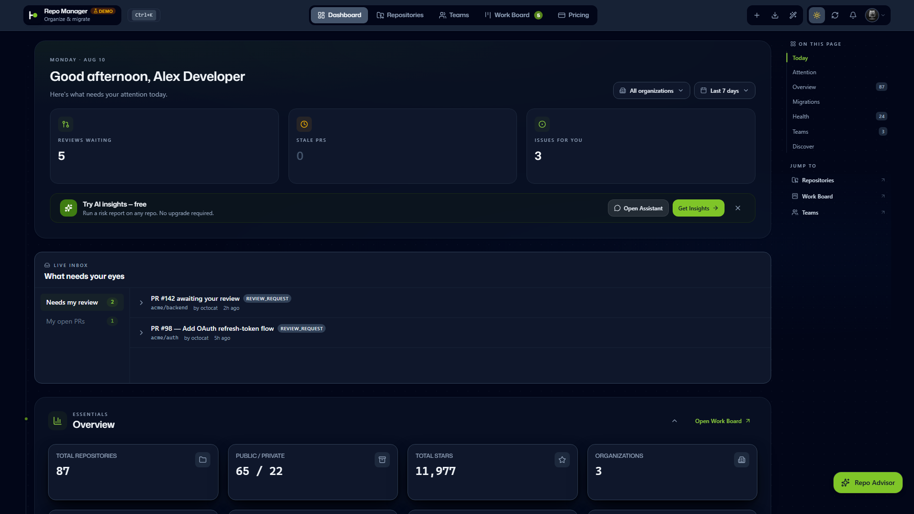

### Dashboard Hero (mobile)

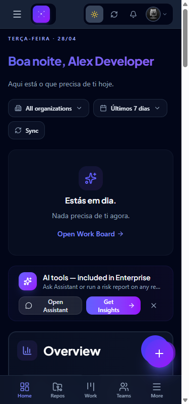

### Migration Wizard

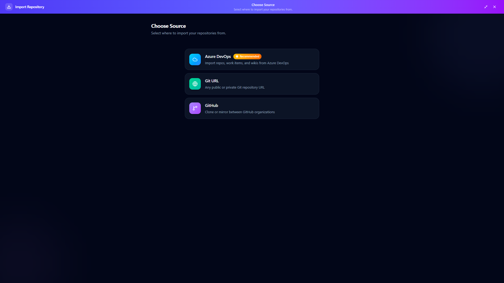

</div>

---

## Why GitHub Repo Manager?

Managing a growing GitHub ecosystem is hard. Between dozens of repositories, multiple organizations, team permissions, CI/CD pipelines, and now migrating from Azure DevOps — developers waste hours on repetitive management tasks.

**GitHub Repo Manager** solves this by providing:

- **One dashboard** to see everything: repos, teams, actions, health metrics
- **AI intelligence** to analyze, search, and improve your repositories automatically
- **Migration tools** to move from Azure DevOps (including TFVC) to GitHub in minutes
- **Bulk operations** to manage hundreds of repos with a few clicks
- **Zero setup needed** — try it instantly in Demo Mode with 87 pre-loaded mock repositories

> Built with the latest stack: React 19, Vite 8, Express 5, Tailwind CSS 4, and BYOK AI — bring your own Gemini, Anthropic, OpenAI, OpenRouter, or LMStudio key.

---

## Table of Contents

- [Features Overview](#features-overview)
- [AI-Powered Intelligence](#ai-powered-intelligence)
- [Azure DevOps Migration Suite](#azure-devops-migration-suite)
- [Quick Start (Demo Mode)](#quick-start-demo-mode)
- [Installation](#installation)
- [Configuration](#configuration)
- [Architecture](#architecture)
- [Tech Stack](#tech-stack)
- [AI Workflow Examples](#ai-workflow-examples)
- [Screenshots Gallery](#screenshots-gallery)
- [Troubleshooting](#troubleshooting)
- [FAQ](#faq)
- [Roadmap](#roadmap)
- [Contributing](#contributing)
- [Support This Project](#support-this-project)
- [License](#license)

---

## Features Overview

### Comprehensive Dashboard

Get a bird's-eye view of your entire GitHub ecosystem at a glance.

- **DashboardHero** — personalised, time-of-day greeting (`Good morning` / `Good afternoon` / `Good evening`), org-filter and time-range chips that round-trip through the URL, and a "What needs you" grid surfacing reviews waiting / stale PRs / open issues with week-over-week deltas and a celebratory empty state.
- **Live Inbox** — replaces the Attention Feed with a sectioned, actionable inbox (needs review, my open PRs, mentions, stale drafts). Archive with `e`, snooze with `s`. AI one-liners on the top 3 items (BYOK, Gemini). Enable with `localStorage.setItem('dashboard_premium_v2_inbox', '1')`. Archive/snooze state persists per-user; both actions are free-tier. See the [Live Inbox feature guide](docs/features/dashboard-live-inbox.md).

  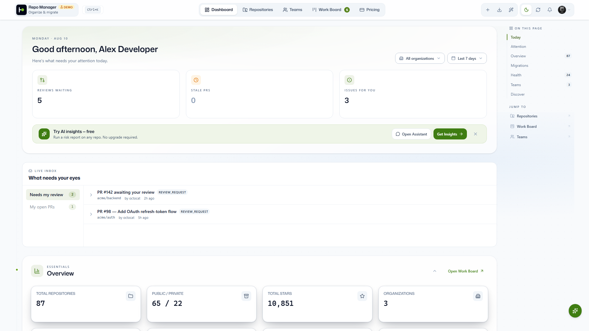
- **Attention Feed** — legacy top-three-repos signal, available as fallback when the Live Inbox flag is off.
- **Real-time Statistics** — Total repos, public/private distribution, stars, forks, organizations.
- **Activity Trends** — Interactive charts showing development activity over 7/30/90 days.
- **Language Distribution** — Technology breakdown across all your projects.
- **Organization Overview** — Quick insights with star, fork, and issue counts per org.
- **Migration Activity** — Track migration progress and history.
- **Auto-dismissing AI promo strip** — quietly disappears once you've engaged with Repo Advisor and Insights surfaces enough times.

### Advanced Repository Management

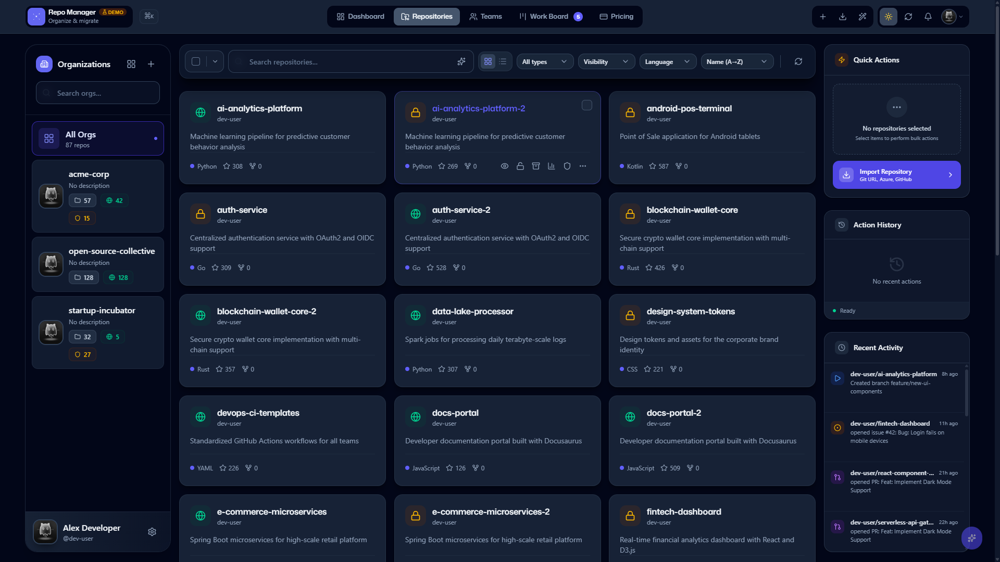

Organize, filter, and manage your repositories with powerful tools built for scale.

- **Smart Search & Filters** — Find repos by name, language, visibility, type, or archived status
- **AI Semantic Search** — Natural language search powered by vector embeddings
- **Bulk Actions** — Archive, delete, transfer, or change visibility for multiple repos at once
- **Repository Creation** — Quick creation with AI-generated descriptions
- **Detailed Repo View** — Branches, PRs, issues, releases, actions, and community health
- **Repository Insights** — AI-powered quality reports with actionable recommendations

### Team Collaboration Hub

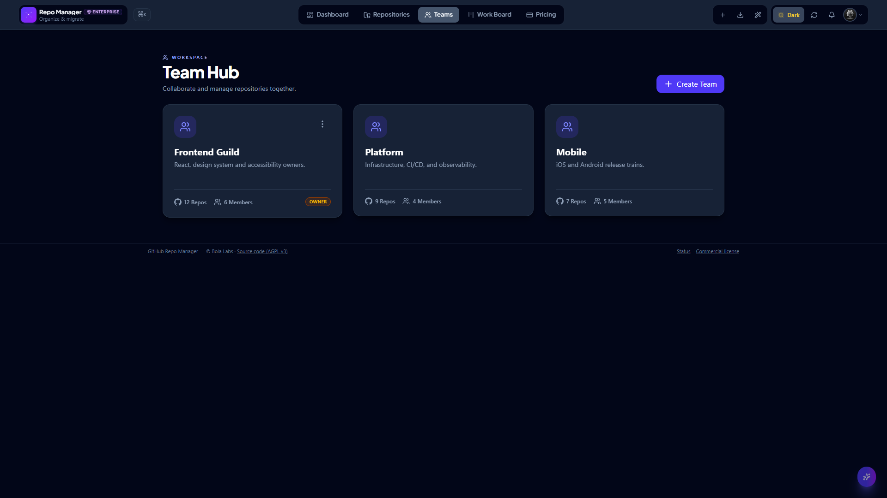

- **Team Overview** — Centralized view of all teams and their repositories
- **Member Management** — Add/remove members with role assignment (Owner, Admin, Member)
- **Team Activity Stream** — Aggregated events from all team repositories
- **Team Actions Statistics** — CI/CD metrics across all team repos
- **Quick Repo Access** — Jump to any team-managed repository instantly

### GitHub Actions Analytics

- **Workflow Metrics** — Success rates, failure tracking, duration analysis
- **Daily Trends** — Interactive charts (30-90 day windows)
- **Workflow Triggering** — Trigger workflows directly from the dashboard
- **CSV Export** — Download statistics for reporting
- **Team-Level Analytics** — Aggregate metrics across multiple team repos

### Community Health Metrics

- **Health Score (0-100)** — Based on documentation, community standards, and activity
- **File Checklist** — Verify README, LICENSE, CONTRIBUTING, CODE_OF_CONDUCT, SECURITY
- **Smart Recommendations** — Priority-ranked suggestions (high/medium/low)
- **Multi-Repo Comparison** — Compare health scores across repositories
- **Performance Cache** — Fast repeated access with intelligent caching

### Cross-Repo Work Board

A single cockpit across all your repositories — no context switching, no manual repo registration.

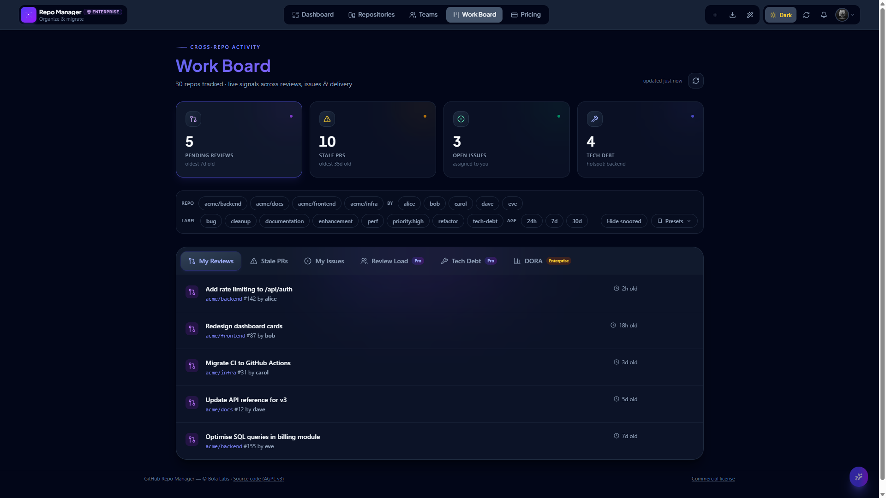

Filters are URL-synced and round-trip through the browser history — share a filtered view by copy-pasting the URL.

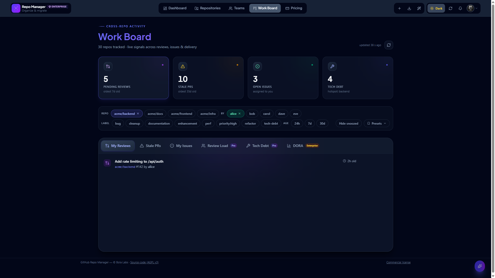

#### Tracked repos & discovery

The Work Board operates on an explicit set of **tracked repositories** that you can pin / mute / untrack from anywhere in the app. Discovery seeds the set automatically from five signal collectors (review-requested, authored, assigned, owned, recently-committed) so you don't start with an empty board, and the **Settings → Work Board** page exposes virtualised lists, bulk actions, signal-aware search, and a "Discover now" panel with auto-mute toggle.

Cross-app integration:

- `TrackedDot` indicator on every RepoCard
- `TrackedChip` in RepoDetail and PR Review headers
- Header nav badge showing pending-review count (driven by `useWorkBoardBadgeCounts`)
- Dashboard "Your Work" card with live counts

#### KPI tiles & trends

KPI tiles show count-up animations, sparklines (last 7 days), and delta badges. Snapshots persist in `work_board_kpi_snapshots` (migration 017) via a daily sweeper job, exposed at `GET /api/v1/work-board/kpi-snapshots`.

#### Repo Advisor (BYOK, opt-in, monthly cap)

- **AI summary card** — two-column layout with urgency glow; the prompt receives 7-day trend snapshots so the headline reflects momentum, not just snapshot state.
- **Suggestion chips on rows** — `POST /api/v1/work-board/suggest-action` returns `ping` / `snooze` / `view` chips on hover/focus; clicking `Ping` opens an inline typewriter draft comment (no more `window.prompt`).
- **Conversational edits** — describe what you want ("mute all forks, keep only tesla org") and review a preview before applying. Implemented with deterministic suggestion engine + HMAC-signed validity tokens for the diff handoff.
- **Suggestions panel** with Apply / Dismiss; dismissed suggestions persist server-side.
- **Activity card** with monthly spend + cap progress; opt-in toggle and cap selector live in the WorkBoard AI section of Settings.

#### Inline actions everywhere

- **Per-row menu** — pin / mute / untrack on every Work Board tab.
- **Empty-state discovery** — `EmptyStateDiscovery` with a one-click "Discover now" CTA when no repos are tracked.
- **Approve / request-changes / snooze** a PR directly on the row (falls back to a re-auth prompt if the OAuth scope is missing).
- **Auto-refresh** — polls every 60 s, pauses when the tab is hidden, shows "updated N ago".
- **Keyboard nav** — `j` / `k` / `↑` / `↓` row navigation, `Enter` to open, `.` approve, `x` request changes, `s` / `Shift+S` snooze, `u` unsnooze, `r` re-request review, `/` focus filter, `?` help modal.
- **Command Palette group** — `⌘K` surfaces a Work Board section with one-shortcut navigation to every tab plus AI regenerate / palette suggestions.

  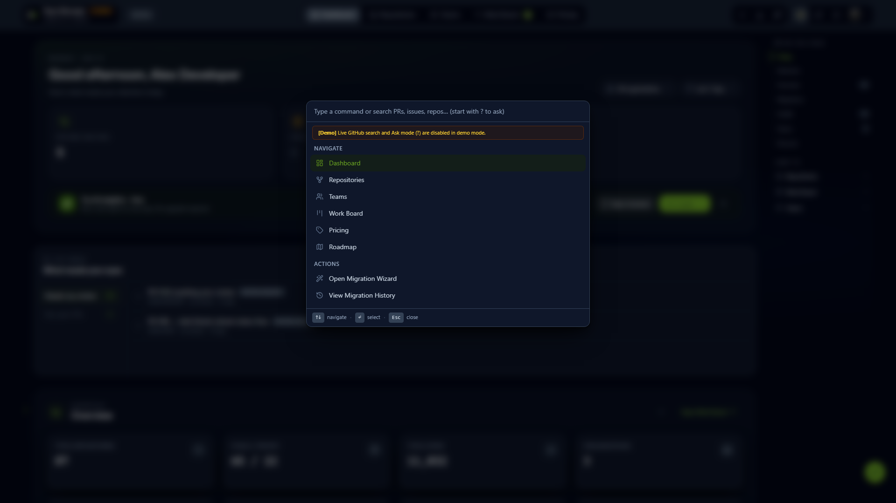

#### Tabs on offer

- **My Reviews** — every PR where you are a requested reviewer, sorted by age.
- **My Issues** — every open issue assigned to you across all tracked repos.
- **Stale PRs** — PRs open beyond a configurable threshold, ranked by staleness.
- **Review Load** — per-reviewer submitted vs pending counts, visualised as stacked bars to spot overloaded reviewers at a glance.
- **Tech Debt** — open issues labelled with `tech-debt`, `technical-debt`, `debt`, `refactor`, `refactoring`, `cleanup` or `code-smell`, grouped by repo with hotspot ranking.
- **DORA Metrics** (Enterprise) — deploy frequency, lead-time p50/p90, change failure rate, MTTR p50/p90, and CSV export for the whole 4-metric set.

Filters and presets:

- **Filters + URL sync** — multi-select by repo / author / label, single-select age bucket (24 h / 7 d / 30 d), hide snoozed toggle. Selection reflected in the URL and saveable as a server-side preset.
- **Zero-config data** — live-fetches PRs and issues from GitHub when no webhook is configured; ETag-revalidated with a 5-minute cache.
- **Webhook auto-track** — incoming GitHub webhooks auto-insert the source repo as tracked the first time they're seen.

### Command Palette (Ctrl+K)

Keyboard-first navigation across the entire app — search repos, jump to any page, trigger bulk actions, manage tracked repos.

- **Conversational ask mode** — natural-language queries pass through `/api/ai/translate-search` (5-minute cache) and convert into GitHub Search syntax with results streamed inline.
- **Contextual command groups** — the available commands change with your active view (Dashboard / RepoDetail / WorkBoard / PR Review).
- **Recents + footer keyboard hints** keep frequent actions discoverable.
- **Work Board controls** — pin / mute / track / refresh / discover-now from the palette, plus a tracked-repos fuzzy search (`/api/v1/work-board/repo-search`).

### Mobile-first UX

- **Bottom-nav** — Home / Repos / Work / Teams / More, with a pending-review dot on the Work tab. The "More" entry opens a bottom sheet for Pricing / Settings / sign-out.
- **`MobileQuickActionsFab`** — bottom-right FAB expands Create / Import / Dev Toolkit with stagger and ESC handling.
- **Mobile drawer** — left-side navigation drawer reachable from the floating menu button, focus-trapped and body-scroll-locked.

### Onboarding tour

A 3-step carousel (`useOnboarding` + `OnboardingTour`) introduces the Dashboard, Work Board, and Migration Wizard on first sign-in. Skip / dismiss is sticky; a re-run button lives in **Settings → Onboarding** for when you want a refresher.

### BYOK — Multi-Provider AI

Configure any of these providers in Settings → AI Configuration:

| Provider | Free tier | Models |
|----------|-----------|--------|
| Google Gemini | Yes | gemini-2.5-flash, gemini-2.5-pro |
| Anthropic | No | claude-opus-4, claude-sonnet-4-5 |
| OpenAI | No | gpt-4o, o4-mini |
| OpenRouter | Yes (50 req/day) | 30+ models |
| LMStudio | Local (free) | Any local model |

### Additional Features

- **Dark/Light Mode** — System preference detection with manual toggle
- **Keyboard Shortcuts** — Command palette (Ctrl+K), navigation, and action shortcuts
- **Responsive Design** — Desktop, tablet, and mobile with touch-optimized targets (44px min); ultrawide (>1920px) displays gain a fourth repo-grid column and balanced gutters via named `nav:` / `wide:` / `ultra:` breakpoints
- **Accessibility** — Focus traps, ARIA roles, screen reader support, skip navigation
- **Smart Notifications** — Non-intrusive toast feedback on all actions
- **Local Caching** — Fast performance with intelligent data caching
- **Offline Support** — Continue browsing cached data when disconnected
- **GitHub Webhook Ingestion** — real-time PR, issue, and deployment events (see `docs/event-ingestion.md`)

---

## AI-Powered Intelligence

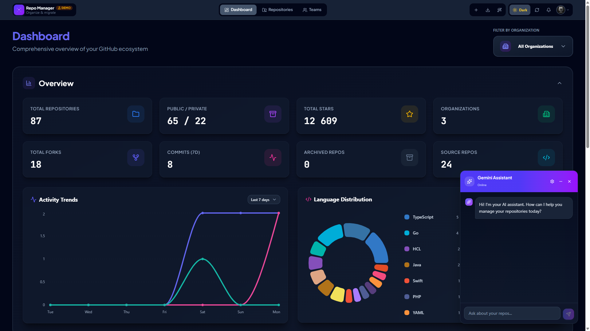

GitHub Repo Manager integrates AI via **BYOK** (Bring Your Own Key) — configure Gemini, Anthropic, OpenAI, OpenRouter, or LMStudio in Settings → AI Configuration. 10+ AI features ship on every tier.

The AI layer is provider-neutral (`AI_PROVIDER`) and production-hardened: a global spend cap and per-call output-token cap (OWASP LLM10), PII-safe audit metadata on every call, SSE streaming replies that preserve partial text on disconnect, BYOK hardening (key rotation, model-id validation, DNS re-checks), and a golden-eval suite gated in CI. Repo Advisor answers are answer-first, grounded, and cited.

### Repo Advisor — conversational assistant
- **Natural Language Interface** — Ask questions about your repositories in plain English
- **Context-Aware Responses** — Answers tailored to your specific projects and data
- **Quick Actions** — Execute common tasks through conversation

### Conversational Task Automation (new in v3.3.0)
The assistant doesn't just answer — it **dispatches real app actions** from natural-language intent. Ask "start a migration from Azure" and it opens the Migration Wizard for you; say "create a new repo" and the creation modal appears pre-focused.

<div align="center">


</div>

| Intent example | Action dispatched |
|----------------|-------------------|
| "migrate from Azure DevOps" | Opens the 8-step Migration Wizard |
| "show me past migrations" | Opens the Migration History panel |
| "create a new repository" | Opens the Create Repo modal |
| "transfer this repo to another org" | Opens the Transfer modal |
| "open settings" | Opens the Settings panel |

Available on **every tier including Free** — the full AI product surface (Assistant, Semantic Search, Migration Risk Analysis, PR Review read-only) ships on the Free plan with per-feature monthly caps. Implementation lives in [`src/utils/aiActions.js`](src/utils/aiActions.js) with strict allow-list validation: any action `type` not in the five above is silently dropped, so the model cannot invoke arbitrary app state changes.

### Repository Analysis & Quality Reports
- **Quality Scoring (0-100)** — Comprehensive analysis across 4 categories:
  - Documentation (30 pts), Community (20 pts), Engineering (20 pts), Polish (10 pts)
- **Pattern Detection** — Automatically identifies missing README sections, CI/CD, tests, license
- **Actionable Recommendations** — Priority-ranked suggestions for improvement

### AI-Enhanced Features

| Feature | Description |
|---------|-------------|
| **README Generation** | Create professional READMEs based on project structure |
| **README Enhancement** | Intelligently add missing sections to existing docs |
| **Smart Topics** | AI-generated tags for better discoverability |
| **Project Classification** | Auto-detect project type (library, app, tool, etc.) |
| **Semantic Search** | Find repos using natural language via vector embeddings |
| **Commit Generator** | AI-powered conventional commit messages from diffs |
| **AI Review Step** | AI-powered risk assessment embedded in the migration wizard |
| **Batch Indexing** | Index up to 10 repos at once for semantic search |
| **BYOK / Multi-provider** | Gemini, Anthropic, OpenAI, OpenRouter, LMStudio — configurable per user in Settings |

> Without any key configured, AI features return high-quality mock responses automatically.

### AI Deep Review (NEW)

A premium PR review experience that turns the in-app PR view into a tool developers actively choose over github.com — generating a structured walkthrough, line-level review comments with one-click code suggestions, PR-context slash commands, and a streaming Q&A chat. One click batches the whole thing into a single GitHub review with a clear AI-generated footer. See the [AI Deep Review feature guide](docs/features/ai-deep-review.md).

- **Walkthrough tab** — markdown summary, per-file change table, and a Mermaid sequence diagram (Pro).
- **Comments tab** — up to 25 line comments with editable `suggestion` blocks; dismiss / edit before publishing (Pro).
- **Commands tab** — `/describe`, `/test_plan`, `/improve` PR-context slash commands with "Apply to PR" outbox-backed body PATCH (Pro).
- **Chat tab** — streaming Q&A on the PR with per-`(user, PR)` persisted history, sanitised inputs, and cancellable SSE (Pro).
- **Prompt Studio** — built-in presets plus custom presets at user / repo / org scope, path-scoped rules, severity floor, and a `${REPO_STYLE_GUIDE}` token that inlines `.repomanager/review-rules.md` (Pro for custom prompts; built-ins read-only on every tier).

---

## Plans & Pricing

The hosted product ships three tiers. The **Free tier includes the full AI product surface** — Assistant, Semantic Search, Migration Risk Analysis, and PR Review — so you can evaluate the AI without a credit card. Each AI capability has its own monthly cap on Free so one feature can't drain your whole budget.

| Feature                                | Free            | Pro ($19/mo)  | Enterprise |
|----------------------------------------|-----------------|---------------|------------|
| Repositories managed                   | 200             | Unlimited     | Unlimited  |
| Repo Advisor (conversational)          | ✓               | ✓             | ✓          |
| AI queries / month (total)             | 200             | 5,000         | Unlimited  |
| Semantic Search                        | 75 / month      | Unlimited     | Unlimited  |
| Migration Risk Analysis (AI)           | 5 / month       | Unlimited     | Unlimited  |
| Repo Insights / Quality Report         | 15 / month      | Unlimited     | Unlimited  |
| README Generator (AI)                  | 5 / month       | Unlimited     | Unlimited  |
| Commit Generator (AI)                  | 50 / month      | Unlimited     | Unlimited  |
| PR Review Experience (read + browse)   | ✓               | ✓             | ✓          |
| Manual PR review write-back            | ✓               | ✓             | ✓          |
| AI Deep Review — walkthrough + comments + publish | ✗    | ✓             | ✓          |
| AI Deep Review — Prompt Studio (custom presets, path rules, severity floor) | ✗ | ✓ | ✓ |
| AI Deep Review — org-shared prompts    | ✗               | ✓             | ✓          |
| AI Deep Review — PR slash commands (`/describe`, `/test_plan`, `/improve`) | ✗ | ✓ | ✓ |
| AI Deep Review — PR Chat (streaming Q&A) | ✗             | ✓             | ✓          |
| Basic bulk on own repos                | ✓               | ✓             | ✓          |
| Advanced bulk (transfer, mirror, cross-org) | ✗          | ✓             | ✓          |
| Azure DevOps Cloud migration           | 1 / month       | Unlimited     | Unlimited  |
| Mirror Sync (preview free, apply Pro)  | Preview         | ✓             | ✓          |
| Dry-Run migration                      | ✓               | ✓             | ✓          |
| Teams                                  | Up to 3 (5 each)| 15 members    | Unlimited  |
| Audit Logs                             | ✗               | ✗             | ✓          |
| SSO / SAML _(roadmap)_                 | ✗               | ✗             | ✗          |
| API keys                               | 5               | 10            | 50         |

Self-hosting under AGPL v3 is free forever — see [LICENSE](LICENSE). The matrix above describes the hosted SaaS.

See the [Free Tier Expansion spec](docs/specs/2026-04-15-free-tier-expansion.md) for the design rationale and enforcement details.

---

## Azure DevOps Migration Suite


A complete migration platform for moving from Azure DevOps to GitHub with a guided **8-step wizard**.

### What You Can Migrate

| Source | What | How |
|--------|------|-----|
| **Git Repos** | Complete history, branches, tags | Direct clone with full preservation |
| **TFVC Repos** | Up to 180 days of history | Automatic TFVC-to-Git conversion via Azure Import API |
| **Work Items** | Types, states, comments, attachments | Azure Boards to GitHub Issues with field mapping |
| **Wikis** | All pages and content | Git-based clone with markdown conversion |

### Migration Features

- **Guided Wizard** — 8-step flow: Source Type, Configuration, Repo Selection, Target Config, Wiki, Work Items, AI Review, Execute
- **AI-Assisted Planning** — AI-powered risk analysis with severity levels and mitigation suggestions
- **Auto-Fix Drawer** — One-click resolution for blocker-level issues (size > 10 GB, name conflicts, reserved/invalid names). Choices persist across the wizard: a repo flagged for LFS migration is pre-selected the next time you open the drawer, the blocker badge clears, and the LFS toggle is auto-enabled in the Configure step.
- **Smart URL Parser** — Supports 6+ Azure DevOps URL formats (dev.azure.com, visualstudio.com, SSH, shorthand)
- **Dry-Run Mode** — Test migrations without making changes
- **Scheduling** — Queue migrations for off-peak execution
- **Pause/Resume** — Interrupt and continue without data loss
- **Task Retry** — Retry individual failed tasks without re-running everything
- **Conflict Detection + Resolution** — Pre-check for existing repos in target, then resolve each naming conflict inline (replace / rename / skip) with a type-to-confirm modal for destructive replaces; failed conflict tasks offer one-click **Replace & retry** from the progress and summary screens
- **Git LFS retry** — Oversized-file failures offer "Retry with Git LFS" (automatic `git lfs migrate` conversion + LFS object push)
- **Encrypted Credentials** — PATs encrypted at rest with AES-256-GCM
- **Progress Tracking** — Real-time updates with per-task status and duration
- **Full Audit Trail** — Complete migration history with error details

### TFVC Support (Industry-Leading)

GitHub Repo Manager is one of the few tools that handles **TFVC-to-Git conversion** automatically:
- Detects TFVC vs Git repositories in Azure DevOps projects
- Converts via Azure DevOps Import API (preserves up to 180 days of history)
- Falls back to ZIP snapshot if conversion fails
- Handles repositories up to 1GB per folder
- Supports projects with mixed Git + TFVC repos

---

## Quick Start (Demo Mode)

Try the full application instantly — **no API keys or GitHub account needed**.

```bash
# Clone the repository
git clone https://github.com/brunobola-portfolio/GitHub-Repo-Manager.git
cd GitHub-Repo-Manager

# Install dependencies
npm install

# Start in demo mode (default)
npm run dev:all
```

Open [http://localhost:5173](http://localhost:5173) and explore with **87 pre-loaded mock repositories**, simulated organizations, teams, and AI responses.

---

## Installation

### Prerequisites

- **Node.js** 18+ (20+ recommended)
- **npm** or **yarn**
- **GitHub account** (for real mode with OAuth)
- **AI provider key** (optional — add your own Gemini, Anthropic, OpenAI, OpenRouter, or LMStudio key in Settings → AI Configuration after first login; see `docs/ai-providers.md`)

### Setup

1. **Clone the repository**
   ```bash
   git clone https://github.com/brunobola-portfolio/GitHub-Repo-Manager.git
   cd GitHub-Repo-Manager
   ```

2. **Install dependencies**
   ```bash
   npm install
   ```

3. **Configure environment**
   ```bash
   cp .env.example .env
   ```
   Edit `.env` with your credentials (see [Configuration](#configuration) below).

4. **Start the application**
   ```bash
   # Frontend + backend together, with a unified premium dev banner (recommended)
   npm run dev:all

   # Same, but launch the backend under the Node inspector for breakpoints
   npm run dev:all:debug

   # Or run each service on its own:
   npm run dev:server  # Backend (API) on :3001
   npm run dev         # Frontend (Vite) on :5173

   # Free a stuck port from a previous run (3001 + 5173–5180), then re-run:
   npm run dev:kill
   ```

   `npm run dev:all` prints one banner with both URLs, the `/api` proxy, the
   active env/log level, and backend health, and tags every log line `WEB` or
   `API` so the two streams never blur. Running `npm run dev` on its own (no
   backend) prints a single hint instead of repeating proxy errors.

5. **Open** [http://localhost:5173](http://localhost:5173)

### Docker Quick Start

Run the full stack with a single command using Docker Compose.

```bash
# Clone the repository
git clone https://github.com/brunobola-portfolio/GitHub-Repo-Manager.git
cd GitHub-Repo-Manager

# Configure environment
cp .env.example .env
# Edit .env with your values (see Configuration section)

# Run with Docker Compose
docker compose up -d

# App is now running at http://localhost:3001
```

---

## Configuration

### Mock Mode vs. Real Mode

| Feature | Mock Mode (Default) | Real Mode |
|---------|-------------------|-----------|
| **Setup** | Zero config | GitHub OAuth + .env |
| **Repositories** | 87 mock repos | Your real repos |
| **AI Features** | Mock responses | AI-powered |
| **Migration** | UI only | Fully functional |
| **Best for** | Demos, UI testing | Production use |

### Environment Variables

The essentials to get started:

```env
# GitHub OAuth (required for real mode)
GITHUB_CLIENT_ID=your_github_oauth_client_id
GITHUB_CLIENT_SECRET=your_github_oauth_client_secret

# Server security (required in production)
SESSION_SECRET=<random 48+ byte string>
WEBHOOK_SECRET=<random 48+ byte string>

# Frontend / dev
FRONTEND_URL=http://localhost:5173
VITE_MOCK_MODE=true
```

See `.env.example` for the complete list of variables, including AI configuration (`GEMINI_API_KEY`, `AI_REQUIRE_USER_CONFIG`), email delivery (`EMAIL_PROVIDER`, `RESEND_API_KEY`), Stripe billing (`STRIPE_SECRET_KEY`), license issuance (`LICENSE_SIGNING_PRIVATE_KEY_PEM`), data retention (`DATA_RETENTION_DAYS`), and observability (`LOG_LEVEL`, `SENTRY_DSN`).

### Setting Up GitHub OAuth

1. Go to **GitHub Settings** > **Developer settings** > **OAuth Apps**
2. Click **New OAuth App**
3. Configure:
   - **Application name**: GitHub Repo Manager
   - **Homepage URL**: `http://localhost:5173`
   - **Authorization callback URL**: `http://localhost:3001/api/auth/callback`
4. Copy the **Client ID** and **Client Secret** to your `.env` file

### Setting Up AI Features (BYOK)

AI features use **Bring Your Own Key** — each user configures their own provider key in the app:

1. Log in via GitHub OAuth
2. Open **Settings → AI Configuration**
3. Choose your provider: Gemini, Anthropic, OpenAI, OpenRouter, or LMStudio
4. Paste your API key — it is encrypted at rest with AES-256-GCM

See [`docs/ai-providers.md`](docs/ai-providers.md) for per-provider setup instructions and free-tier limits.

> **Single-tenant self-hosts**: you may set `GEMINI_API_KEY` in `.env` as a shared server-wide fallback so users don't need to configure their own key. Set `AI_REQUIRE_USER_CONFIG=true` to disable this fallback in multi-tenant deployments.
>
> Without any key configured, AI features return high-quality mock responses automatically.

---

## Architecture

<div align="center">

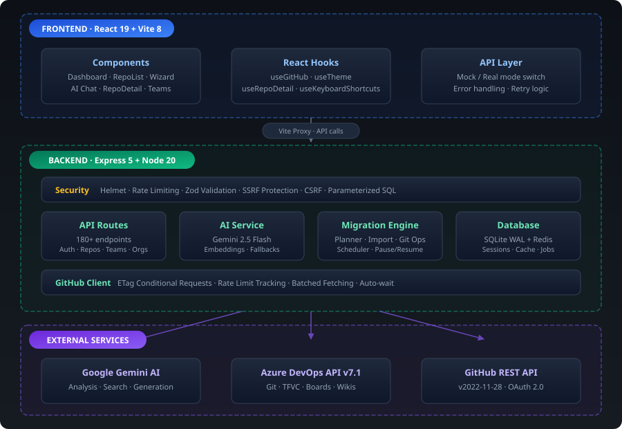

</div>

For detailed architecture documentation, see [`docs/architecture/overview.md`](docs/architecture/overview.md).

---

## Tech Stack

| Category | Technologies |
|----------|-------------|
| **Frontend** | React 19.2, Vite 8.0, TailwindCSS 4.1 |
| **UI/UX** | Framer Motion 12, Lucide Icons 1.8, Recharts 3, Radix UI, cmdk |
| **Backend** | Node.js 20+, Express 5.2 |
| **Database** | better-sqlite3 12.9 (WAL mode, 32 MB cache) |
| **Security** | Helmet.js, express-rate-limit (per-tier + per-IP auth-route), shared Zod request-validation layer (`validation_failed` envelope), SSRF + DNS-rebinding guard, CSRF double-submit, AES-256-GCM credential encryption |
| **AI (BYOK)** | Anthropic, OpenAI, Google Gemini, OpenRouter, LMStudio / local — provider-neutral (`AI_PROVIDER`), per-user keys encrypted at rest, global spend cap + per-call output-token cap, PII-safe audit metadata, SSE streaming |
| **APIs** | GitHub REST API (v2022-11-28), Azure DevOps API (v7.1), Stripe Billing |
| **Logging** | Pino (structured JSON, automatic credential redaction) + Sentry breadcrumbs |
| **Testing** | Vitest (5,200+ unit tests) + Testing Library + Playwright, with a dual-theme (light + dark) axe accessibility gate |
| **Auth** | GitHub OAuth 2.0 (CSRF state), Azure DevOps OAuth |
| **CI gates** | ESLint `max-warnings 0`, build-honesty test (no mock leaks), bundle-budget (≤ 415 KB gzip eager), README honesty regression guard, dual-theme axe a11y gate, AI golden-eval gate |

### GitHub Permissions

| Scope | Purpose |
|-------|---------|
| `repo` | List, create, update, and delete repositories (public and private) |
| `read:org` | Display organizations and team memberships |
| `user` | Fetch profile information |
| `delete_repo` | Required for bulk delete action |
| `admin:org` | Create teams, manage organization settings (optional) |

> **Security**: Tokens are stored in encrypted server-side sessions (`httpOnly`, `sameSite: lax`, rolling with a 7-day absolute ceiling). The backend uses Helmet.js headers, tier-aware rate limiting, parameterized SQL queries throughout, and a shared Zod request-validation layer (`validateBody` / `validateQuery` / `validateParams`) that returns a consistent `400 { error, code: 'validation_failed' }` across PR write-backs, repo contents, issue labels/assignees, webhook updates, workflow dispatch, community-health, AI and billing/license/search/API-key routes. Azure PATs and BYOK provider keys are encrypted at rest with AES-256-GCM + PBKDF2-HMAC-SHA256 key derivation.

---

## AI Workflow Examples

Real examples of what the AI can do for your repositories:

| Task | How | What You Get |
|------|-----|--------------|
| **Find repos without CI** | Type "repos without CI/CD" in search | Filtered list with setup recommendations |
| **Generate documentation** | Click "Generate README" on any repo | Professional README based on project structure |
| **Assess migration risk** | AI Review step inside the migration wizard | Risk report with severity levels and mitigation plan |
| **Check repo quality** | Click "Analyze" on any repository | Score 0-100 across docs, community, engineering, polish |
| **Find similar projects** | Search "repos like my-api-service" | Embedding-based similarity results across all your repos |
| **Write commit messages** | Open commit generator with a diff | Conventional commit message matching your changes |
| **Improve discoverability** | Click "Suggest Topics" on a repo | AI-generated tags based on project content |
| **Enhance existing docs** | Click "Enhance README" | Missing sections added intelligently to your existing README |

### How It Works

<div align="center">

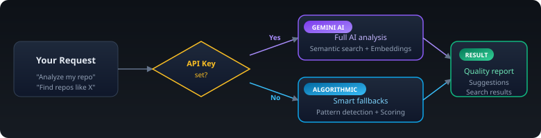

</div>

- **With a provider key** (configured in Settings → AI Configuration): Full AI-powered analysis, semantic search with vector embeddings, natural language chat
- **Without any key**: Algorithmic fallbacks for quality scoring, pattern detection, and smart suggestions — the app works perfectly either way

See [`docs/ai-providers.md`](docs/ai-providers.md) for per-provider setup and free-tier limits.

---

## Screenshots Gallery

<details>
<summary><strong>Click to expand all screenshots</strong></summary>

### Dashboard (Dark Mode)


### Dashboard (Light Mode)
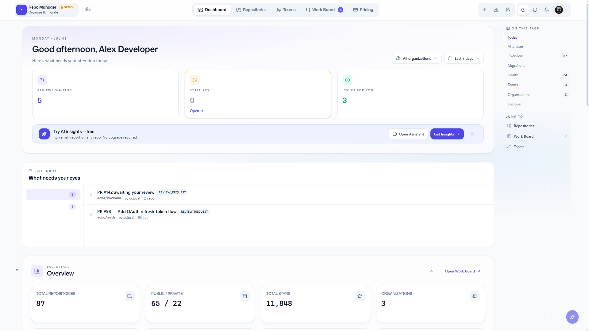

### Repository Management


### Team Hub


### Migration Wizard


### Repo Advisor


### Live Inbox — needs_review section


### Live Inbox — my open PRs

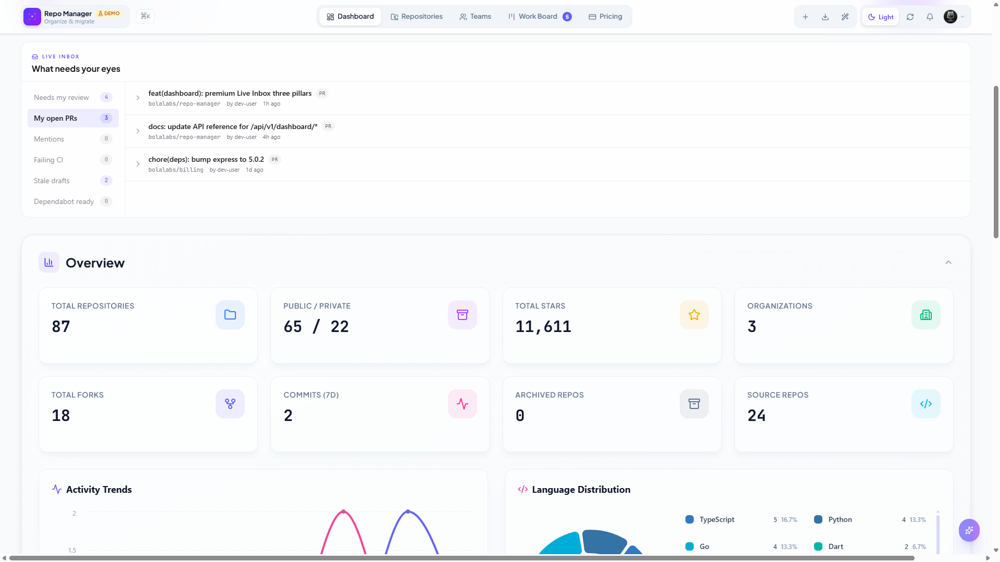

### Live Inbox — expanded row + dark mode

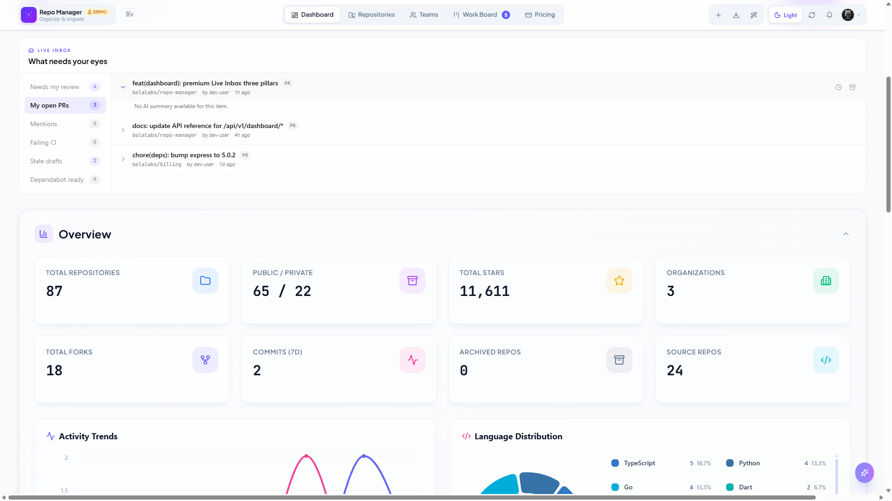
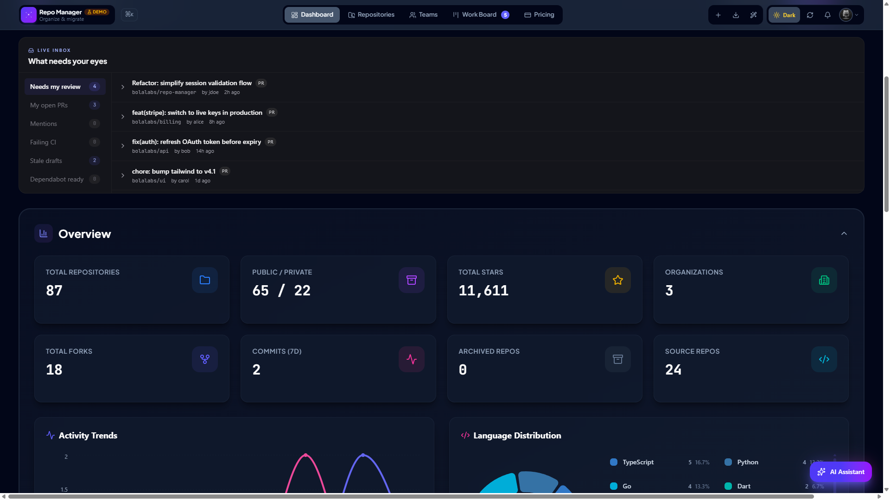

### Live Inbox — snooze modal

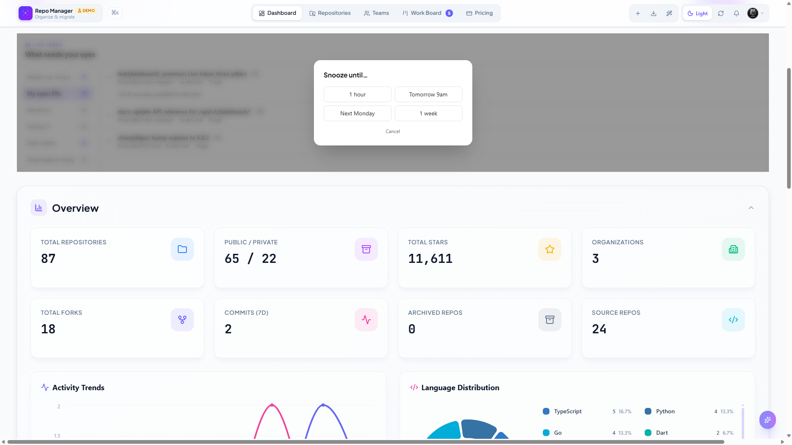

### Live Inbox — stale drafts

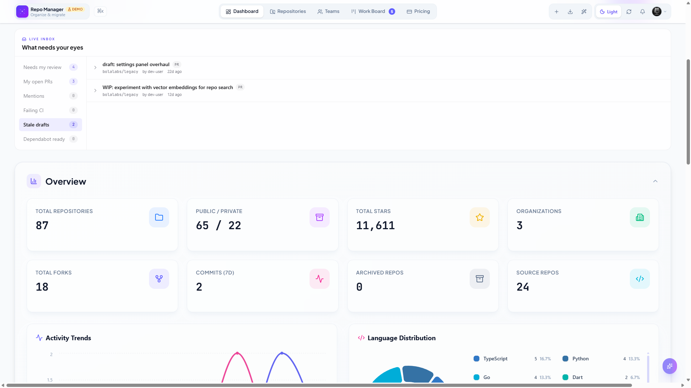

### Live Inbox — mobile (375 px)

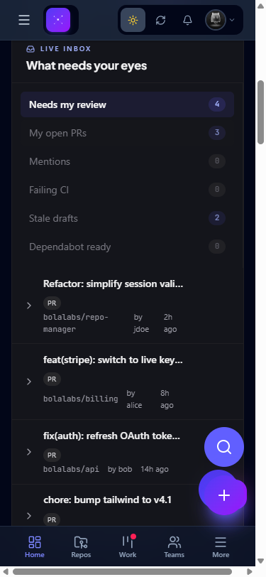

### Work Board (Dark Mode)


### Work Board (Light Mode)

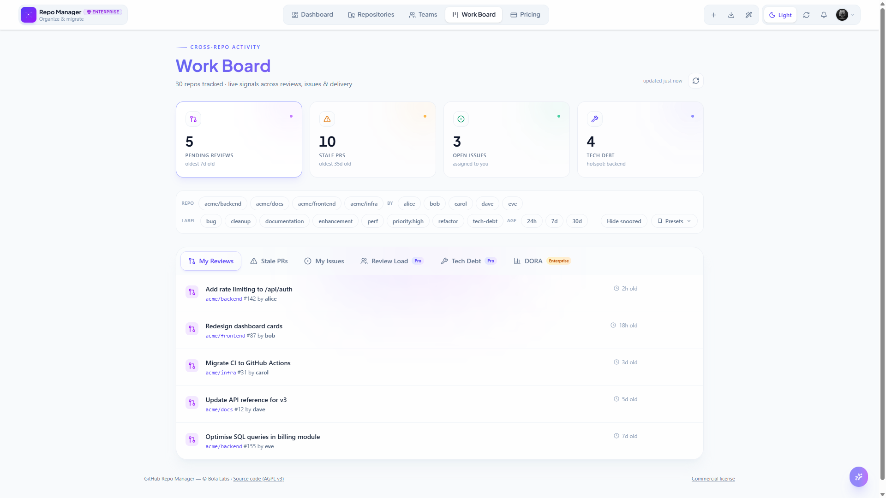

### Work Board — Filters Applied


### Work Board — Command Palette


</details>

---

## Troubleshooting

<details>
<summary><strong>Backend Server Not Running (ECONNREFUSED)</strong></summary>

If you start the frontend on its own (`npm run dev`) without the API, Vite prints
a single throttled hint instead of repeating `ECONNREFUSED` stack traces:

```text
[vite]   ⚠  Backend API not reachable on :3001 — run `npm run dev:all` (web + API) or `npm run dev:server` (API only).
```

**Solution**: Run both servers together with `npm run dev:all` (recommended), or start the backend separately:
```bash
npm run dev:server
```
Verify at `http://localhost:3001/api/health`.

</details>

<details>
<summary><strong>Port Already in Use</strong></summary>

If you see `Port is already in use` (backend 3001) or `Port 5176 is in use, trying another one...` (Vite cascading through 5173–5180), a previous dev server is still alive. One-shot cleanup:

```bash
npm run dev:kill
```

Works on Windows/macOS/Linux — kills anything listening on 3001, 5173–5180 using `netstat`+`taskkill` or `lsof`+`kill` depending on the OS. Then re-run `npm run dev:all`.

Manual fallback if the script isn't available:

```bash
# Windows
netstat -ano | findstr :5173
taskkill /PID <pid> /F

# macOS/Linux
lsof -ti:5173 | xargs kill -9
```

</details>

<details>
<summary><strong>GitHub OAuth Callback Error</strong></summary>

Ensure your OAuth app's callback URL matches exactly:
- Development: `http://localhost:3001/api/auth/callback`
- Production: `https://yourdomain.com/api/auth/callback`

</details>

<details>
<summary><strong>AI Features Not Working (503)</strong></summary>

1. Verify `GEMINI_API_KEY` is set in `.env`
2. Check validity at [Google AI Studio](https://aistudio.google.com/apikey)
3. Without a key, mock responses are returned automatically

</details>

<details>
<summary><strong>Native Module Version Mismatch</strong></summary>

```bash
# Quick fix
npm run fix:native

# Or manual rebuild
npm rebuild better-sqlite3

# Full reinstall (last resort)
rm -rf node_modules package-lock.json && npm install
```

</details>

<details>
<summary><strong>Session Lost on Refresh</strong></summary>

Check that `SESSION_SECRET` is set in `.env` and the backend is running.

</details>

---

## FAQ

<details>
<summary><strong>General Questions</strong></summary>

**Q: Do I need a GitHub account?**
A: No! Demo mode works without any accounts. Real mode requires GitHub OAuth.

**Q: Is my data secure?**
A: Yes. Encrypted session cookies, server-side token storage, parameterized SQL, and all data stays on your machine.

**Q: Can I use this with GitHub Enterprise?**
A: Not yet — it's planned for a later release. See [ROADMAP.md](ROADMAP.md) for details.

**Q: Does this work offline?**
A: The UI works offline with cached data. Live features require internet.

</details>

<details>
<summary><strong>AI Features</strong></summary>

**Q: Do I need to pay for AI?**
A: Several providers have free tiers — Google Gemini offers 250 req/day, OpenRouter 50 req/day. See [`docs/ai-providers.md`](docs/ai-providers.md).

**Q: What data is sent to AI?**
A: Only repository metadata (name, description, topics, README). Never code content.

**Q: Can I use a different AI provider?**
A: Yes. Go to **Settings → AI Configuration** and choose from Gemini, Anthropic, OpenAI, OpenRouter, or LMStudio. Each user can configure their own key. See [`docs/ai-providers.md`](docs/ai-providers.md) for setup details.

</details>

<details>
<summary><strong>Migration</strong></summary>

**Q: Can I migrate TFVC repositories?**
A: Yes! Automatic TFVC-to-Git conversion with up to 180 days of history preserved.

**Q: What about work items and wikis?**
A: Full support — Azure Boards items become GitHub Issues, wikis are cloned with markdown conversion.

**Q: Is migration destructive?**
A: No. Source repos are never modified. Use dry-run mode to test first.

</details>

---

## Recently Shipped

### v4.5.0 — Production readiness (2026-07-06)

The production-readiness release: a 10-specialist audit (88 findings) followed by eight remediation waves on `main`. Full detail in [`CHANGELOG.md`](CHANGELOG.md).

- **Repo Advisor rebuilt end-to-end** — provider-neutral `AI_PROVIDER`, answer-first grounded/cited error KB, code-block copy, SSE streaming, per-call output-token cap + global AI spend cap (OWASP LLM10), PII-safe audit metadata, Pro-tier quota across every AI route, BYOK hardening (key rotation, model-id validation, DNS re-checks), and a golden-eval suite with a CI eval gate.
- **Migration Replace, end-to-end** — resolve naming conflicts (replace / rename / skip) with a type-to-confirm modal, one-click "Replace & retry", and "Retry with Git LFS" for oversized files.
- **Environment tooling readiness** — tool registry, `npm run doctor`, `/api/env` status endpoint with admin-gated in-app installs, and per-plan preflight that fails migrations with an actionable error instead of a mid-job crash.
- **GDPR data lifecycle** — registry-driven account erasure across every user-scoped table (schema-introspection completeness test) with a per-table deletion receipt, plus a corrected data export.
- **Operations hardening** — WAL-safe scheduled SQLite backups with retention, daily/hourly maintenance janitors, `/live` + `/ready` health probes, HTTP compression, SSE-aware graceful shutdown, and a documented restore runbook.
- **Quality gates grew with the product** — 5,200+ unit tests, a dual-theme (light + dark) axe accessibility gate (9 views × 2 themes = 18 hard-gated scans), and ESLint anti-drift rules for design tokens. Schema changes now run through a versioned migration ledger instead of loose `.sql` files.

### v4.0.0 — AI Deep Review (2026-05-08)

The full premium PR review surface. See the [AI Deep Review feature guide](docs/features/ai-deep-review.md) for end-user docs and the [spec](docs/specs/2026-05-03-ai-deep-review.md) / [slice 1a plan](docs/plans/2026-05-03-ai-deep-review-slice-1a.md) / [slice 1b plan](docs/plans/2026-05-04-ai-deep-review-slice-1b.md) for design depth.

- **Slice 1a — free core engine.** `runDeepReview` produces a markdown walkthrough + per-file change table + Mermaid sequence diagram + up to 25 line comments with `suggestion` blocks. Drafts persist in `ai_pr_reviews`; new `<PRReviewView>` + `<AIReviewPanel>` (Walkthrough / Comments / Commands / Chat tabs) render them. One-click batched publish through the existing outbox with idempotency key `pr-deep-review:{draftId}:{event}` — double-clicks across server restarts collapse into a single GitHub review row. 5 routes under `/api/ai/deep-review/*`. Free with BYOK key. MOCK_MODE returns canned fixture; publish in mock mode is honest (no fabricated `githubReviewId`).
- **Slice 1a-2 — production hardening.** Provider `usageMetadata` threading (Gemini / Anthropic / OpenAI / OpenRouter / local), unified `computeCostUSD` cost wiring, LRU sweep on the in-memory rate limiter, mermaid theme observer, modal focus trap via `useFocusTrap`.
- **Slice 1b — Premium Prompt Studio.** `ai_review_prompts` table, 5 built-in presets (general / security / performance / accessibility / refactor), per-repo + per-user defaults, path-scoped rules, severity floor, `${REPO_STYLE_GUIDE}` token substitution from `.repomanager/review-rules.md`. 7 routes under `/api/ai/prompt-studio/*` (CRUD requires Pro; GET endpoints free so the picker renders for all tiers). New top-level `/ai/prompts` page with Library + Editor + PromptPicker.
- **PR Slash Commands (Pro).** `/describe`, `/test_plan`, `/improve` invokable from a Commands tab in the AI Review Panel. `/describe` → "Apply to PR" PATCHes the body via the outbox with body-hash idempotency. 4 routes under `/api/ai/pr-commands/*`, all `requireTier('pro')`. Per-user 20/h rate limit. New `ai_pr_commands` table.
- **PR Chat tab (Pro).** 4th tab in `<AIReviewPanel>` — streaming Q&A via SSE on `POST /api/ai/pr-chat/:owner/:repo/:pr` using the existing `useStreaming` infra. Per-`(user, PR)` history persisted in `ai_pr_chat_messages` with `MAX_HISTORY_TURNS = 10` collapse. Defence in depth: every PR-derived string sanitised via `sanitizeForPrompt`. AbortController on unmount + new send + cancel. MIN scope — server-side tool execution (`read_pr_file`, `list_pr_comments`) deferred; table columns are forward-compatible.
- **Org-shared prompts (Pro).** `scope='org'` end-to-end. New `github-org-membership.js` helper (`isOrgMember`, `filterOrgsByMembership`, `getCurrentUserOrgs`, cached 5 min via gh-cache). Resolution chain: explicit `presetKey` → repo-default → user-default → **org-default** → built-in `general`. Org members read org-shared presets even when not authors; PATCH / DELETE / set-default still author-only. "shared · {org}" + "read-only" badges in the Prompt Library.
- **Premium UX unification.** Unified AI error vocabulary (17 codes) and shared `<AIErrorState>` mounted in 5 high-traffic surfaces; 401→422 fix so AI provider auth errors stop colliding with session-expiry; 60 s / 90 s `AbortController` timeouts on `useAI.askAI` + `useAIDeepReview.generate`; new global `<DemoModeBanner>` for mock-mode signal; `<SafeMarkdown>` (react-markdown + rehype-sanitize) for every model-output surface; Prompt Studio reachable from Settings → AI + Command Palette; PRFilesTab "reviewed" state persisted to localStorage.
- **AI polish sweep.** ConfirmModal ported to the `<Modal>` primitive; OpenRouter pricing prefix normalisation (`anthropic/claude-*` resolves to real Anthropic pricing); `core.js` endpoints (chat / suggest / readme / readme-enhance) unified through `quotaExceededResponse` + `handleAIError`; BatchIndexProgressModal per-chunk recovery; AIAssistant CTA branching by `err.code`; useStreaming preserves `err.code` + `retryAfterSec`.
- **Surface uniformity.** 4 new shared primitives — `<SectionPanel>`, `<HeroHalo>`, `<CountUp>`, `<PageMount>` — applied across Dashboard / RepoDetail / WorkBoard. All honour `prefers-reduced-motion`. RepoDetail tabs upgraded from flat `<Card>` to `<SectionPanel>`.
- **Drawer consolidation.** Unified `<Drawer side="left|right|bottom">` primitive replacing Sheet, MobileDrawer, SidePanel, and AutoFixDrawer's bespoke shell. Bottom variant adds drag handle + `safe-area-inset-bottom` + swipe-to-dismiss (drag-y > 100 px or velocity > 500). 10 consumers migrated; 3 primitives deleted. Fixed a pre-existing bug where `MobileDrawer side="bottom"` was silently routing to right (RepoFilterBar + SelectionSheet were sliding from the wrong edge).
- **Multi-agent audit pass.** Closed the cycle with a security + code-health sweep: prompt-injection guards on every `/ai/*` body (Zod schema + `sanitizeForPrompt` whitelist), DNS-rebinding defence on import (`assertSafeExternalUrl` + `resolveAndValidateHost`), cross-user cache isolation (`contextCache` keyed by userId, bounded LRU), `requireTier('pro')` on every deep-review handler, license-cache TTL, hook_id route-param validator, Mermaid SVG XSS hardening (`parseAndSanitizeSvg` + `replaceChildren`), and `closeOnBackdrop=false` across 16 large modals + 2 state-bearing drawers (Settings, Migration AutoFix, DLQ admin, etc.) so accidental backdrop clicks no longer discard in-progress edits. ~600 LoC of duplicated plumbing extracted into shared modules (`appEvents`, `bannerMotion`, `in-memory-rate-limiter`, `repos/_shared.js`, `time.js`/`format.js` adoption).

### v3.8.0 (April 2026)

- **Dashboard hero redesign** — unified `DashboardHero` with personalised greeting, URL-synced org / time-range chips, "What needs you" grid with weekly deltas, and an auto-dismissing AI promo strip.
- **Mobile UX overhaul** — 5-item bottom-nav (`Home / Repos / Work / Teams / More`), `MobileQuickActionsFab`, mobile drawer with focus trap, "More" bottom sheet.
- **Work Board — tracked repos + AI upgrade (7 phases)** — explicit tracked-repo set with five-signal discovery, virtualised settings UI, inline pin/mute/untrack on every row, KPI sparklines + deltas, AI summary card with urgency glow, suggestion chips (`ping` / `snooze` / `view`), conversational-edit preview-then-apply.
- **Premium AI Configuration** — curated model dropdowns, per-feature override section, per-feature key-health pills, admin probe stats tab.
- **Honest error handling** — `formatUserError` + `toast.errorFromException` (50 callsites migrated), `QuotaExceededState` modal mounted on `app:show-quota-exceeded`, server `quotaErrorPayload` / `tierRequiredPayload` helpers, ESLint rule forbidding `.stack` access in `src/components/`.
- **Onboarding tour** — 3-step `OnboardingTour` carousel with focus trap and a Settings re-run button.
- **Cross-app polish** — conversational ask mode in `Ctrl+K`, real notifications digest in the header, AI narrative for the top Attention Feed item, branch hygiene panel, AI-suggested topics in RepoDetail.
- **CSRF coverage on every mutating call site** — 30+ hand-rolled `fetch()` mutations now route through `getCsrfToken()`.
- **CI guards** — bundle-size budget (415 KB gzip eager set), build-honesty test (no mock-repo strings in production bundles), README honesty regression guard.
- **UI primitive consolidation** — `Spinner` / `SectionSpinner`, `PageShell` / `PageHeader`, `EmptyState`, `Skeleton`, `Card`, expanded `Button` variants. 25 standalone `Loader2` sites migrated; lint guard prevents reintroduction.

### v3.7.0–v3.7.2 (April 2026)

- **Admin DLQ UI + CLI** — Email + Webhook DLQs with retry / resolve / filter, plus zero-dep CLI scripts (`admin:grant`, `admin:dlq*`, `admin:dlq:sweep`).
- **Public `/status` page** — unauthenticated, polls `/api/health/ready`.
- **Session-expiry hook** — soft warn < 1 h before the 7-day session ceiling, hard warn < 5 min.
- **Husky v9 + lint-staged v16** — pre-commit `eslint --fix --max-warnings 0` and a `console.log` / `debugger` rejection.

### v3.4.0–v3.6.0 (April 2026)

- **BYOK multi-provider AI** — Gemini, Anthropic, OpenAI, OpenRouter, LMStudio per-user; AES-256-GCM at rest.
- **GitHub event ingestion pipeline** — real-time PR, issue, and deployment webhooks (see [`docs/event-ingestion.md`](docs/event-ingestion.md)).
- **Cross-Repo Work Board (initial release)** — my reviews / stale PRs / my issues / review load / Tech Debt / DORA.
- **CSRF middleware + double-submit token**, **SSRF guard on `/api/import/url`**, **rolling session + 7-day absolute timeout**, **per-IP auth-route rate limit**, **mandatory `CREDENTIAL_ENCRYPTION_KEY` in production**.
- **GitHub API circuit breaker + Retry-After honouring**; **email + webhook DLQs**; **route-level lazy splits + vendor-icons chunk**; **WCAG 2.1 AA pass on form surfaces**.
- **CODEOWNERS Suggest endpoint + UI**; **Compare-with-existing side-by-side diff modal**; **Command Palette live GitHub search**; **AI Issue-to-PR Planner (plan-only)**; **Self-service GDPR (Article 17 + 20)**.

### v3.0.0–v3.3.x

- **AGPL Open-Core licensing** with Ed25519-signed JWT license keys + Stripe checkout / portal / webhook flow.
- **Repo Advisor action dispatch** — Migration Wizard, Create Repo, Transfer, History, Settings opened from natural-language intent.
- **Migration Repo Select redesign** — 10-rule risk engine + 5 batched Azure enrichment endpoints + virtualised slide-in detail panel.
- **Auto-Fix Drawer** with persistent size-strategy choices and "Fix applied" badge.
- **Modal system redesign**, **reusable TabBar**, **Health Dashboard Premium**, **Rate Limit UX**.

See [`CHANGELOG.md`](CHANGELOG.md) for the full history.

## Roadmap

See [ROADMAP.md](ROADMAP.md) or the in-app `/roadmap` page for what's next. Every feature on the Pricing page works today; upcoming items are honestly scoped as **Shipping Now** / **Next** / **Later**.

---

## Contributing

We welcome contributions! Whether it's bug fixes, new features, or documentation improvements.

### Quick Start for Contributors

1. **Fork** the repository
2. **Clone** your fork: `git clone https://github.com/YOUR-USERNAME/GitHub-Repo-Manager.git`
3. **Create a branch**: `git checkout -b feature/AmazingFeature`
4. **Make changes** and commit: `git commit -m 'feat: Add AmazingFeature'`
5. **Push**: `git push origin feature/AmazingFeature`
6. **Open a Pull Request**

### Development Guidelines

- **Code Style**: ESLint — run `npm run lint` before committing
- **Commits**: [Conventional Commits](https://www.conventionalcommits.org/) format
- **Testing**: Add tests for new features — run `npm test` to verify
- **Files**: `.jsx` only (no TypeScript), Tailwind CSS utilities
- **Documentation**: Update README and docs when adding features
- **Bundle analysis**: Run `npm run build:analyze` to open an interactive treemap showing what's inside each bundle chunk.

See [`CONTRIBUTING.md`](CONTRIBUTING.md) for detailed guidelines.

---

## Support This Project

If this project has helped you or you find it interesting, consider supporting its development:

<div align="center">

[](https://buymeacoffee.com/brunobola)
[](https://ko-fi.com/brunobola)
[](https://github.com/brunobola-portfolio/GitHub-Repo-Manager)

</div>

Your support helps:
- Fix bugs and improve stability
- Develop new features requested by the community
- Create better documentation and tutorials
- Maintain dependencies and ensure compatibility

---

## License

Distributed under the **GNU Affero General Public License v3 (AGPL-3.0)**. See [`LICENSE`](LICENSE) for details.

A **commercial license** is available for organizations that need to use this software without AGPL obligations. See [`LICENSE-COMMERCIAL.md`](docs/LICENSE-COMMERCIAL.md) for terms, or contact [bruno@bolalabs.pt](mailto:bruno@bolalabs.pt).

### AGPL §13 — Source offer for network operators

If you run a modified version of this software as a network service, AGPL §13 requires you to offer users the corresponding source code. This repo includes a machine-readable endpoint for that purpose:

```http
GET /api/v1/system/source
```

```json
{
  "license": "AGPL-3.0-only",
  "sourceUrl": "https://github.com/brunobola-portfolio/GitHub-Repo-Manager",
  "commercialLicenseUrl": "https://bolalabs.pt/license",
  "notice": "Modified versions running as a network service must offer their corresponding source under AGPL §13."
}
```

**If you fork and deploy this as a service, edit [server/routes/system.js](server/routes/system.js) and update `sourceUrl` to point at your modified source repo** so downstream consumers can programmatically discover it. Keep the endpoint reachable without authentication — AGPL §13 requires the offer to be made to every user of the network service.

---

## Acknowledgments

- **Anthropic** — Claude Code for AI-assisted development
- **Google** — Gemini AI API for intelligent features
- **React Team** — React 19 with concurrent features
- **Vite Team** — Lightning-fast build tooling
- **Tailwind Labs** — TailwindCSS 4 with next-gen features
- **GitHub** — Comprehensive REST API
- **All Contributors** — Who make open source possible

---

<div align="center">

### Contact & Links

**Bruno Silva Marques** | [Bola Labs](https://github.com/brunobola-portfolio)

[](https://github.com/brunobola-portfolio)
[](https://www.linkedin.com/in/bolalabs/)

---

**Built with React 19, Vite 8, BYOK AI, and Claude Code**

[Overview](#why-github-repo-manager) |
[Features](#features-overview) |
[AI](#ai-powered-intelligence) |
[Migration](#azure-devops-migration-suite) |
[Get Started](#quick-start-demo-mode) |
[Contribute](#contributing) |
[Support](#support-this-project)

</div>
