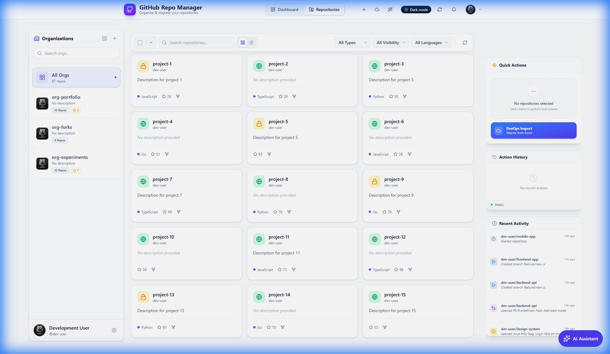
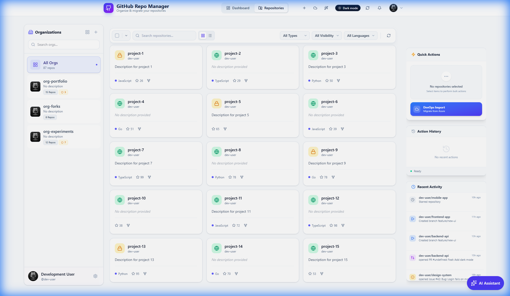
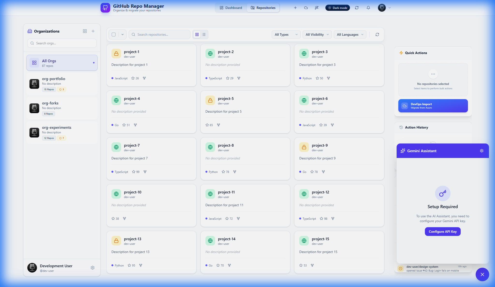

# GitHub Repository Manager

**Your personal command center for GitHub.**  
Manage your repositories, organize your portfolio, and perform bulk operations with ease—all from a beautiful, modern interface.

  

## 🚀 Why this exists

Managing hundreds of repositories on GitHub can be tedious. Whether you're cleaning up old forks, organizing your portfolio into organizations, or just trying to get a bird's-eye view of your code, the default GitHub UI often requires too many clicks.

**GitHub Repo Manager** solves this by giving you a powerful dashboard to:
*   **Bulk Edit**: Make 50 repos private in one click.
*   **Organize**: Transfer multiple projects to an organization instantly.
*   **Clean Up**: Archive or delete stale forks in batches.
*   **Analyze**: See stats and trends across all your organizations.

---

## ✨ Key Features

### 🛡️ Core Management
*   **Bulk Visibility Control**: Toggle privacy settings for multiple repos at once.
*   **Mass Transfer**: Move repositories between accounts and organizations seamlessly.
*   **Smart Archiving**: Quickly identify and archive unused projects.
*   **Mirroring**: Create backups/forks of repositories into other organizations.

### 📊 Insights & Dashboard
*   **Global Overview**: View total stars, forks, and activity across all your accounts.
*   **Organization Filter**: Drill down into specific organizations to see what's happening.
*   **Language Breakdown**: See your most used languages visually.

### 💎 Premium Experience (New!)
*   **Glassmorphism UI**: A stunning, modern interface with frosted glass effects and smooth animations.
*   **Interactive Dashboard**: Visualized data with beautiful charts and real-time organization filtering.
*   **Enhanced Navigation**: A redesigned sidebar for effortless switching between organizations and repositories.

### 👥 Team Management & Collaboration
*   **Teams Hub**: Create, Edit, and Delete teams to organize your workflow.
*   **Member Management**: Invite GitHub users to your teams directly.
*   **Repo Assignments**: Manage repository access for specific teams.
*   **Activity Stream**: A unified timeline of all team activity (Push, PRs, Comments) grouped by date.

### 🤖 AI-Powered Assistance
*   **Smart Suggestions**: Get AI-driven tips on how to improve your repository metadata.
*   **Auto-README**: Generate professional READMEs for your projects in seconds.
*   **Natural Language Search**: Find "my private react apps" just by typing it.

---

## 📸 Screenshots

<p align="center">
  
</p>
<p align="center"><b>Global Insights & Analytics</b></p>

<br />

| Repository List | AI Assistant |
|:---:|:---:|
|  |  |
| **Bulk Management** | **Smart Chat** |


---

## �🛠️ Quick Start

### Prerequisites
*   Node.js 18+
*   A GitHub Account

### Installation

1.  **Clone the repository**
    ```bash
    git clone https://github.com/your-username/github-repo-manager.git
    cd github-repo-manager
    ```

2.  **Install dependencies**
    ```bash
    npm install
    ```

### 🚀 Demo Mode
Want to try it without setup?
```bash
npm run dev
```
(Runs with Mock Data enabled by default)

MIT License.

---

*Built by Bruno Marques – Bola Labs, Inc.*
