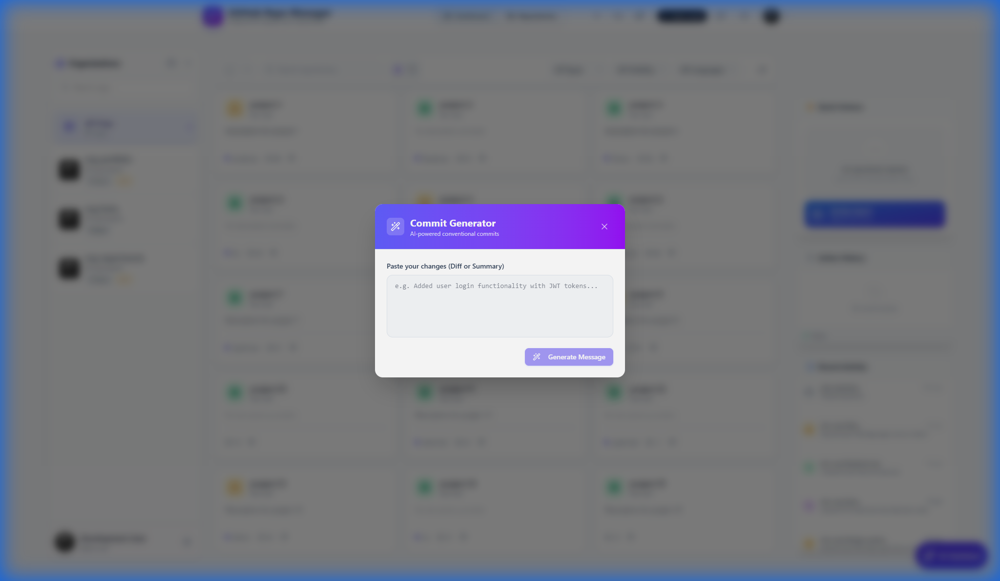

# GitHub Repository Manager

**Your personal command center for GitHub.**  
Manage your repositories, organize your portfolio, and perform bulk operations with ease—all from a beautiful, modern interface.

  

## 🚀 Why this exists

Managing hundreds of repositories on GitHub can be tedious. Whether you're cleaning up old forks, organizing your portfolio into organizations, or just trying to get a bird's-eye view of your code, the default GitHub UI often requires too many clicks.

**GitHub Repo Manager** solves this by giving you a powerful dashboard to:
*   **Bulk Edit**: Make 50 repos private in one click.
*   **Organize**: Transfer multiple projects to an organization instantly.
*   **Clean Up**: Archive or delete stale forks in batches.
*   **Analyze**: See stats and trends across all your organizations.

---

## ✨ Key Features

### 🛡️ Core Management
*   **Bulk Visibility Control**: Toggle privacy settings for multiple repos at once.
*   **Mass Transfer**: Move repositories between accounts and organizations seamlessly.
*   **Smart Archiving**: Quickly identify and archive unused projects.
*   **Mirroring**: Create backups/forks of repositories into other organizations.

### 📊 Insights & Dashboard
*   **Global Overview**: View total stars, forks, and activity across all your accounts.
*   **Organization Filter**: Drill down into specific organizations to see what's happening.
*   **Language Breakdown**: See your most used languages visually.

### 💎 Premium Experience (New!)
*   **Glassmorphism UI**: A stunning, modern interface with frosted glass effects and smooth animations.
*   **Interactive Dashboard**: Visualized data with beautiful charts and real-time organization filtering.
*   **Enhanced Navigation**: A redesigned sidebar for effortless switching between organizations and repositories.

### 🤖 AI-Powered Assistance
*   **Smart Suggestions**: Get AI-driven tips on how to improve your repository metadata.
*   **Auto-README**: Generate professional READMEs for your projects in seconds.
*   **Natural Language Search**: Find "my private react apps" just by typing it.

---

## � Screenshots

| Dashboard | Repository List |
|:---:|:---:|
|  |  |
| **Global Insights** | **Bulk Management** |

| AI Assistant | Organization Settings |
|:---:|:---:|
|  |  |
| **Smart Chat** | **Commit Generator** |

---

## �🛠️ Quick Start

### Prerequisites
*   Node.js 18+
*   A GitHub Account

### Installation

1.  **Clone the repository**
    ```bash
    git clone https://github.com/your-username/github-repo-manager.git
    cd github-repo-manager
    ```

2.  **Install dependencies**
    ```bash
    npm install
    ```

3.  **Start in Demo Mode** (No setup required)
    ```bash
    npm run dev
    ```
    The app will open at `http://localhost:5173` with mock data so you can explore the UI.

---
1. **Clone the repository**
   ```bash
   git clone https://github.com/Start-to-Infinite/GitHub-Repo-Manager.git
   cd GitHub-Repo-Manager
   ```

2. **Install dependencies**
   ```bash
   npm install
   ```

3. **Configure Environment**
   Create a `.env` file in the root directory:
   ```env
   # Server (Backend)
   PORT=3001
   GITHUB_CLIENT_ID=your_github_client_id
   GITHUB_CLIENT_SECRET=your_github_client_secret
   SESSION_SECRET=your_secret_key
   
   # AI Features (Optional - Recommended)
   # If set here, AI features work for all users using the server key.
   # Users can also provide their own key via the app Settings.
   GEMINI_API_KEY=your_gemini_api_key
   
   # Setup GitHub OAuth App > Homepage: http://localhost:5173 > Callback: http://localhost:3001/api/auth/github/callback

   # Client (Frontend)
   VITE_API_BASE_URL=http://localhost:3001
   VITE_MOCK_MODE=false
   ```

4. **Run Development Server**
   ```bash
   npm run dev:all
   ```

MIT License.

---

*Built by Bruno Marques – Bola Labs, Inc.*
