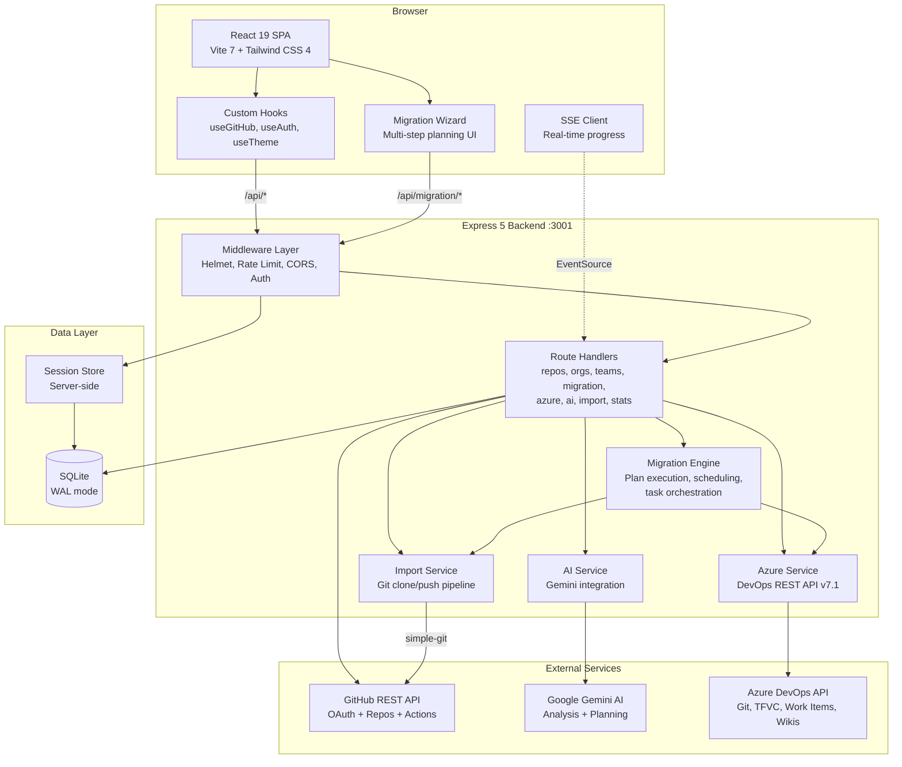

# Architecture Overview

GitHub Repo Manager is a full-stack JavaScript application composed of a React + Vite frontend
and an Express backend that talks to the GitHub REST API.

## High-Level Design

- **Frontend**: React 19 single-page app built with Vite and Tailwind CSS 4.
- **Backend**: Express 5 server exposing a small REST API and handling GitHub OAuth.
- **Auth**: GitHub OAuth App with session-based storage of the access token.
- **Styling**: Tailwind with a global dark/light theme toggle using the `dark` class.

## Frontend

Entry point: `src/main.jsx`

- Renders `<App />` wrapped in a `ThemeProvider`.
- Mounts into `#root` and wires global styles from `src/index.css` and `src/design-system.css`.

Root component: `src/App.jsx`

- Wires together:
  - **Header** (`HeaderNew`) for navigation, auth controls, and theme toggle.
  - **Dashboard** for high-level stats.
  - **Sidebar** for actions and activity history.
  - **RepoList** for the main repository table.
  - **OrgPanel** and **OrgManagerModal** for organization management.
  - Modal components for creating, transferring, and importing repositories.
  - Toast system for success/error notifications.

State & data:

- `src/hooks/useGitHub.js`
  - Central hook for user, repos, orgs, org repos, stats, pagination, and bulk actions.
  - Uses `fetchWithRetry` and related helpers from `src/utils/api.js`.
  - Skips repo loading when no user is authenticated to avoid noisy 401s.
- `src/hooks/useTheme.jsx`
  - Manages light/dark mode using `document.documentElement.classList`.
  - Persists theme preference in `localStorage` and respects system settings.
- `src/hooks/useToast.js`
  - Provides a simple toast API (`toast.success`, `toast.error`) used across the UI.

## Backend

Entry point: `server/index.js`

- Loads configuration from environment variables (see `.env.example`).
- Configures CORS, JSON parsing, and `express-session`.
- Validates the presence of GitHub OAuth credentials at startup.
- Exposes endpoints for:
  - **Auth**: `/api/auth/login`, `/api/auth/callback`, `/api/auth/logout`, `/api/user`.
  - **Repositories**: listing, creating, visibility changes, transfer, mirror, archive, delete.
  - **Organizations**: list orgs, get org details, list org repos.
  - **Azure Import**: Git repo imports, TFVC-to-Git conversion, batch imports, migration stats.
  - **Migration Engine**: plan-based migrations with work items, wikis, and scheduling.
  - **Stats**: aggregate repository statistics.

## Configuration

- `src/config.js` centralizes frontend configuration:
  - `API_BASE_URL`, `AUTH_ENDPOINTS`, `API_ENDPOINTS`, pagination defaults, and mock mode flag.
- `.env.example` documents required backend environment variables:
  - `GITHUB_CLIENT_ID`, `GITHUB_CLIENT_SECRET`, `SESSION_SECRET`, `FRONTEND_URL`, `PORT`.

## Error Handling

- `src/utils/api.js` implements:
  - `ApiError` with typed error categories and user-facing messages.
  - `fetchWithRetry` with exponential backoff and jitter for transient errors.
  - Graceful JSON parsing via `safeParseJson`.
- UI surfaces friendly messages via the toast system and inline hints in the repo table.

## Theming

- Dark mode is driven by a `dark` class on `<html>`.
- `ThemeProvider` synchronizes the class with user preference and system theme.
- Components use Tailwind `dark:` variants to render appropriate backgrounds, borders, and text.

## Migration & Import

The application supports importing repositories from multiple sources:

- **Git URL**: Clone any public or private Git repository via URL.
- **Azure DevOps (Git)**: Import Git repos from Azure DevOps with PAT authentication.
- **Azure DevOps (TFVC)**: Automatically detects TFVC projects and converts them to Git via the Azure DevOps Import Request API (preserves up to 180 days of history). Falls back to ZIP snapshot if conversion fails.
- **GitHub**: Import between GitHub accounts/orgs.

Key services:

- `server/import-service.js` — Git clone + push pipeline using `simple-git`.
- `server/azure-service.js` — Azure DevOps REST API v7.1 (Git, TFVC, work items, wikis).
- `server/migration-engine.js` — Plan-based migration with task types: `repo`, `repo-tfvc`, `work-items`, `wiki`.
- `server/migration-planner.js` — AI-assisted (Gemini) or fallback risk analysis for migrations.

## Database Abstraction Layer

The application supports two database backends via `server/lib/db-adapter.js`:

- **SQLite** (default): Uses `better-sqlite3` with WAL mode. The adapter preserves the synchronous `db.prepare().get/all/run()` API used throughout the route layer.
- **PostgreSQL**: Activated when the `DATABASE_URL` environment variable is set. Uses `node-postgres` (`pg`) and exposes the same interface with async methods (top-level `await` is supported via ESM `"type": "module"`).

Schema is defined in `server/db.js` (`initDB()`) and kept in sync with `server/migrations/001-initial-schema.sql`, which is the SQLite source-of-truth file. A PostgreSQL equivalent (`001-initial-schema.pg.sql`) will be provided when full PostgreSQL support ships.

Multi-tenancy: all per-user tables (`repo_metadata`, `repo_embeddings`, `community_health_cache`, `workflow_runs`, `workflows_meta`) carry a `user_id` column and use composite primary keys `(user_id, repo_id)` to isolate data between accounts.

## Redis

Redis is used for three concerns, each with a dedicated `ioredis` client:

- **Sessions**: `connect-redis` replaces the in-process session store for horizontal scaling and persistence across restarts.
- **Rate limiting**: `rate-limit-redis` backs `express-rate-limit` so rate-limit counters survive server restarts and work across multiple instances.
- **Job queues**: `bullmq` uses Redis streams to run background jobs (e.g. long-running Git imports, migration plan execution) outside the HTTP request lifecycle.

Set `REDIS_URL` in the environment to enable Redis. When the variable is absent the application falls back to in-memory stores (development only).

## API Key Authentication

In addition to the GitHub OAuth session flow, the backend supports programmatic access via API keys stored in the `api_keys` table:

- Keys are issued through `/api/v1/api-keys` and stored as a bcrypt hash (`key_hash`) with a short plaintext prefix (`key_prefix`) for identification.
- Scopes are stored as a JSON array (e.g. `["read", "write"]`) and validated per-endpoint.
- Revocation is soft-delete via the `revoked_at` timestamp.
- All API key activity is written to `audit_log_v2` with the `api_key_id` field populated.

## Subscription Tiers

The application implements three tiers managed through the `user_subscriptions` table:

| Tier | Description |
| ---- | ----------- |
| `free` | Default for all new accounts. Limited API calls and migration jobs. |
| `pro` | Increased limits, priority job queue, advanced analytics. |
| `enterprise` | Unlimited usage, dedicated support, custom integrations. |

Tier enforcement is applied in middleware by reading `user_subscriptions.tier` for the authenticated user. Usage is metered per `metric_type` and billing period in the `usage_metrics` table.

## Stripe Billing Integration

Stripe handles payment collection and subscription lifecycle:

- `stripe_customer_id` and `stripe_subscription_id` are stored in `user_subscriptions` after checkout.
- Webhook events (`customer.subscription.updated`, `customer.subscription.deleted`, `invoice.payment_failed`) update the local subscription status in real time.
- The Stripe webhook endpoint validates signatures using `STRIPE_WEBHOOK_SECRET` before processing any event.

## Sentry Monitoring

Error tracking uses `@sentry/node` on the backend and `@sentry/react` on the frontend:

- Backend: initialized in `server/index.js` before route registration; captures unhandled exceptions and slow transactions.
- Frontend: wraps the React tree with `Sentry.ErrorBoundary`; reports component-level errors with full stack traces.
- Set `SENTRY_DSN` in the environment to enable. Omitting the variable disables Sentry silently.

## API Versioning

All REST endpoints are namespaced under `/api/v1/` to allow non-breaking evolution of the API surface. The version prefix is enforced at the Express router level. Legacy unversioned routes (e.g. `/api/auth/*`) remain for backward compatibility with the OAuth flow and will be migrated in a future release.

## System Architecture Diagram

This document is a high-level guide; see inline comments and the README for more details.
