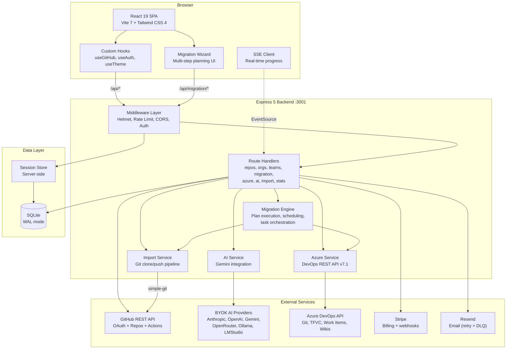

# Architecture Overview

GitHub Repo Manager is a full-stack JavaScript application — a React + Vite SPA
plus an Express backend that brokers GitHub, Azure DevOps, and BYOK AI
providers. SQLite is the default store; PostgreSQL is supported via a single
adapter seam.

> Looking for a feature guide instead? Start at [`docs/index.md`](../index.md).
> For operator runbooks (DLQ, status page, release flow), see
> [`docs/operations.md`](../operations.md).

## High-Level Design

- **Frontend**: React 19 + Vite 8 + Tailwind CSS 4 single-page app, heavy
  route-level lazy splits (WorkBoard, PRReview, Admin) kept under explicit
  gzip budgets (see [`scripts/check-bundle-size.mjs`](../../scripts/check-bundle-size.mjs)).
- **Backend**: Express 5 with ~200 route handlers across 25+ modules under
  `server/routes/`. CSRF double-submit, SSRF guard on import-from-URL,
  per-IP auth rate-limit, rolling session + 7-day absolute timeout.
- **Auth**: GitHub OAuth App, session-based token storage, CSRF-protected
  mutations. Admin tooling keys off a distinct `users.is_admin` flag
  (stricter than subscription tier).
- **BYOK AI**: Anthropic, OpenAI, Gemini, OpenRouter, and local (Ollama /
  LMStudio) providers — selected per feature with per-user credentials
  encrypted with AES-256-GCM + PBKDF2.
- **Styling**: Tailwind with a global dark/light theme toggle via the `dark`
  class; opt-in `ds-*` utility classes for the design system (no global
  element selectors).

## Frontend

Entry point: `src/main.jsx`

- Renders `<App />` wrapped in a `ThemeProvider`.
- Mounts into `#root` and wires global styles from `src/index.css` and `src/design-system.css`.

Root component: `src/App.jsx`

- Wires together:
  - **Header** for navigation, auth controls, and theme toggle.
  - **Dashboard** for high-level stats.
  - **Sidebar** for actions and activity history.
  - **RepoList** for the main repository table.
  - **OrgPanel** and **OrgManagerModal** for organization management.
  - Modal components for creating, transferring, and importing repositories.
  - Toast system for success/error notifications.

State & data:

- `src/hooks/useGitHub.js`
  - Central hook for user, repos, orgs, org repos, stats, pagination, and bulk actions.
  - Uses `fetchWithRetry` and related helpers from `src/utils/api.js`.
  - Skips repo loading when no user is authenticated to avoid noisy 401s.
- `src/hooks/useTheme.jsx`
  - Manages light/dark mode using `document.documentElement.classList`.
  - Persists theme preference in `localStorage` and respects system settings.
- `src/hooks/useToast.js`
  - Provides a simple toast API (`toast.success`, `toast.error`) used across the UI.

## Action Registry

Repository actions (archive, transfer, delete, AI commands, etc.) are declared
once in [`src/actions/repoActions.js`](../../src/actions/repoActions.js) and
consumed by every UI surface — context menu, card quick-actions, selection bar
(desktop pill / mobile bottom-sheet), and the command palette builder.

Each entry is a `RepoAction` object with `id`, `label`, `description`, `icon`,
`intent`, `surfaces`, `confirm`, `run`. The dispatcher
[`runAction(id, target, ctx, registry)`](../../src/actions/runAction.js) is the
single entry point — it gates each action through optional confirmation, runs
it, refreshes the list when `triggersRefresh: true`, and surfaces errors via
toast.

Surfaces are decoupled: each one filters the registry by
`surfaces.includes('contextMenu' | 'quickAction' | 'selectionBar' | 'commandPalette')`
and renders its own way. Adding a new action is a single edit in the registry.

`useRepoActionContext()` packages the dependencies actions need (`api`, `toast`,
modal helpers, `refresh`, mutation wrappers, and a `confirmGate` Promise wrapper
around the existing `showConfirm` modal contract).

**Double-refresh rule.** `archiveRepos` / `deleteRepos` / `performAction`
exposed via `useRepoActionContext` are the React wrappers from `useRepos.js` —
they already call `fetchRepos` on success. Registry actions whose `run()`
delegates to these MUST NOT also declare `triggersRefresh: true`, or the list
refreshes twice. The runner enforces this only at runtime; the JSDoc warning
is the design-time guardrail.

Spec: [`docs/specs/2026-05-01-action-surface-unification.md`](../specs/2026-05-01-action-surface-unification.md).
Plan: [`docs/plans/2026-05-01-action-surface-unification.md`](../plans/2026-05-01-action-surface-unification.md).

## Backend

Entry point: `server/index.js`

- Loads configuration from environment variables (see `.env.example`).
- Configures CORS, JSON parsing, `express-session` (backed by Redis when `REDIS_URL` is set), Helmet, and rate limiting.
- Validates the presence of GitHub OAuth credentials at startup.
- Uses a **modular route structure** with 25+ route files under
  `server/routes/` (plus a `v1/` sub-router for versioned endpoints). Each
  domain area has its own route module:
  - **Auth** (`routes/auth.js`): login, callback, logout, user session,
    `session-info` (authenticated + isAdmin + expiresAt for the frontend
    session-expiry warning).
  - **Repositories** (`routes/repos.js`, `routes/repos/*`): listing, CRUD,
    visibility, transfer, mirror, archive, delete, issues, pulls, releases,
    branches, actions, community health.
  - **Organizations** (`routes/orgs.js`): list orgs, get org details, list
    org repos.
  - **Teams** (`routes/teams.js`): team CRUD, member management, repo
    assignments.
  - **Azure Import** (`routes/azure.js`, `routes/import.js`): Git repo
    imports (SSRF-guarded for URL imports), TFVC-to-Git conversion, batch
    imports.
  - **Migration** (`routes/migration.js`): plan-based migrations with work
    items, wikis, scheduling, and supervised credential cleanup loops.
  - **Billing & Stripe** (`routes/billing.js`, `routes/stripe-webhooks.js`):
    subscription management; Stripe webhook uses synchronous better-sqlite3
    transactions + explicit `forgetIdempotency()` on async failure so retries
    actually re-process.
  - **AI** (`routes/ai.js` + `server/lib/ai-features/*`): BYOK multi-provider
    completions, per-feature overrides, cost hints, retry taxonomy.
  - **Admin DLQ** (`routes/admin-dlq.js`): 8 endpoints under
    `/api/v1/admin/dlq/{email,webhook}/...` — list, detail, retry, resolve.
    All mutations audit-logged in the G1 hash chain under `dlq.*`.
  - **Work Board** (`routes/work-board.js`, `routes/work-board-actions.js`):
    cross-repo review load, stale PRs, DORA metrics, presets, snooze, cache.
  - **License** (`routes/v1/license.js`): Ed25519-signed JWT validation,
    per-file kid resolver, 12 h license cache.
  - **Stats, Audit, Usage, System, Health** (`routes/stats.js`,
    `routes/audit.js`, `routes/usage.js`, `routes/system.js`,
    `routes/health.js`): aggregate stats, SOC 2 CC7.2 hash-chained audit
    trail, usage metering, and `/api/health/ready` behind the public
    `/status` page.
  - **Bulk, Webhooks, API Keys, User** (`routes/bulk.js`, `routes/webhooks.js`,
    `routes/api-keys.js`, `routes/user.js`): bulk ops, webhook handling with
    DLQ, API key management, user profile.

Key infrastructure:

- **Redis** (`ioredis`): session storage (`connect-redis`), rate-limit counters
  (`rate-limit-redis`), and BullMQ job queue streams.
- **BullMQ**: background job queue for long-running Git imports and migration
  plan execution.
- **Stripe**: payment collection and subscription lifecycle via webhooks
  (signature-verified, sync-transaction idempotency).
- **Sentry** (`@sentry/node`, `@sentry/react`): error tracking + breadcrumbs on
  client navigation, mutation starts/ends, and API calls.
- **Pino**: structured JSON logging with request-level context via
  `pino-http`; every response carries a `Server-Timing` header.
- **GitHub API client** (`server/lib/github-api.js`): exponential backoff +
  `Retry-After` honouring + circuit breaker (5 failures / 60 s → 30 s open)
  so GitHub degradations don't cascade into a retry storm.
- **Email delivery** (`server/lib/email.js`): Resend with retry + dead-letter
  queue for terminal failures (replayable via `npm run admin:dlq`).

The full modular route structure is documented in detail in `docs/architecture/backend.md`.

## Configuration

- `src/config.js` centralizes frontend configuration:
  - `API_BASE_URL`, `AUTH_ENDPOINTS`, `API_ENDPOINTS`, pagination defaults, and mock mode flag.
- `.env.example` documents required backend environment variables:
  - `GITHUB_CLIENT_ID`, `GITHUB_CLIENT_SECRET`, `SESSION_SECRET`, `FRONTEND_URL`, `PORT`.

## Error Handling

- `src/utils/api.js` implements:
  - `ApiError` with typed error categories and user-facing messages.
  - `fetchWithRetry` with exponential backoff and jitter for transient errors.
  - Graceful JSON parsing via `safeParseJson`.
- UI surfaces friendly messages via the toast system and inline hints in the repo table.

## Theming

- Dark mode is driven by a `dark` class on `<html>`.
- `ThemeProvider` synchronizes the class with user preference and system theme.
- Components use Tailwind `dark:` variants to render appropriate backgrounds, borders, and text.

## Migration & Import

The application supports importing repositories from multiple sources:

- **Git URL**: Clone any public or private Git repository via URL.
- **Azure DevOps (Git)**: Import Git repos from Azure DevOps with PAT authentication.
- **Azure DevOps (TFVC)**: Automatically detects TFVC projects and converts them to Git via the Azure DevOps Import Request API (preserves up to 180 days of history). Falls back to ZIP snapshot if conversion fails.
- **GitHub**: Import between GitHub accounts/orgs.

Key services:

- `server/import-service.js` — Git clone + push pipeline using `simple-git`.
- `server/azure-service.js` — Azure DevOps REST API v7.1 (Git, TFVC, work items, wikis).
- `server/migration-engine.js` — Plan-based migration with task types: `repo`, `repo-tfvc`, `work-items`, `wiki`.
- `server/migration-planner.js` — AI-assisted (Gemini) or fallback risk analysis for migrations.

## Database Abstraction Layer

The application supports two database backends via `server/lib/db-adapter.js`:

- **SQLite** (default): Uses `better-sqlite3` with WAL mode. The adapter preserves the synchronous `db.prepare().get/all/run()` API used throughout the route layer.
- **PostgreSQL**: Activated when the `DATABASE_URL` environment variable is set. Uses `node-postgres` (`pg`) and exposes the same interface with async methods (top-level `await` is supported via ESM `"type": "module"`).

Schema is defined in `server/db.js` (`initDB()`) and kept in sync with `server/migrations/001-initial-schema.sql`, which is the SQLite source-of-truth file. A PostgreSQL equivalent (`001-initial-schema.pg.sql`) will be provided when full PostgreSQL support ships.

Multi-tenancy: all per-user tables (`repo_metadata`, `repo_embeddings`, `community_health_cache`, `workflow_runs`, `workflows_meta`) carry a `user_id` column and use composite primary keys `(user_id, repo_id)` to isolate data between accounts.

## Redis

Redis is used for three concerns, each with a dedicated `ioredis` client:

- **Sessions**: `connect-redis` replaces the in-process session store for horizontal scaling and persistence across restarts.
- **Rate limiting**: `rate-limit-redis` backs `express-rate-limit` so rate-limit counters survive server restarts and work across multiple instances.
- **Job queues**: `bullmq` uses Redis streams to run background jobs (e.g. long-running Git imports, migration plan execution) outside the HTTP request lifecycle.

Set `REDIS_URL` in the environment to enable Redis. When the variable is absent the application falls back to in-memory stores (development only).

## API Key Authentication

In addition to the GitHub OAuth session flow, the backend supports programmatic access via API keys stored in the `api_keys` table:

- Keys are issued through `/api/v1/api-keys` and stored as a bcrypt hash (`key_hash`) with a short plaintext prefix (`key_prefix`) for identification.
- Scopes are stored as a JSON array (e.g. `["read", "write"]`) and validated per-endpoint.
- Revocation is soft-delete via the `revoked_at` timestamp.
- All API key activity is written to `audit_log_v2` with the `api_key_id` field populated.

## Subscription Tiers

The application implements three tiers managed through the `user_subscriptions` table:

| Tier | Description |
| ---- | ----------- |
| `free` | Default for all new accounts. Limited API calls and migration jobs. |
| `pro` | Increased limits, priority job queue, advanced analytics. |
| `enterprise` | Unlimited usage, dedicated support, custom integrations. |

Tier enforcement is applied in middleware by reading `user_subscriptions.tier` for the authenticated user. Usage is metered per `metric_type` and billing period in the `usage_metrics` table.

## Stripe Billing Integration

Stripe handles payment collection and subscription lifecycle:

- `stripe_customer_id` and `stripe_subscription_id` are stored in `user_subscriptions` after checkout.
- Webhook events (`customer.subscription.updated`, `customer.subscription.deleted`, `invoice.payment_failed`) update the local subscription status in real time.
- The Stripe webhook endpoint validates signatures using `STRIPE_WEBHOOK_SECRET` before processing any event.

## Sentry Monitoring

Error tracking uses `@sentry/node` on the backend and `@sentry/react` on the frontend:

- Backend: initialized in `server/index.js` before route registration; captures unhandled exceptions and slow transactions.
- Frontend: wraps the React tree with `Sentry.ErrorBoundary`; reports component-level errors with full stack traces.
- Set `SENTRY_DSN` in the environment to enable. Omitting the variable disables Sentry silently.

## API Versioning

All REST endpoints are namespaced under `/api/v1/` to allow non-breaking evolution of the API surface. The version prefix is enforced at the Express router level. Legacy unversioned routes (e.g. `/api/auth/*`) remain for backward compatibility with the OAuth flow and will be migrated in a future release.

## Hardening (v3.6+)

The v3.6/v3.7 sprint closed the P0–P4 audit findings. The short list:

- **Security depth**. CSRF double-submit tokens on mutating routes;
  `assertSafeExternalUrl()` SSRF guard on `/api/import/url` (blocks
  localhost, RFC1918, 169.254.169.254 cloud metadata, IPv4-mapped IPv6 into
  private ranges, embedded creds); per-IP auth-route rate limiter; rolling
  session + 7-day absolute timeout; `CREDENTIAL_ENCRYPTION_KEY` mandatory in
  production.
- **Resilience**. GitHub API circuit breaker; email retry + DLQ; webhook
  DLQ; AI provider retry taxonomy; migration engine scheduler + credential
  cleanup loops supervised (crash in one task no longer stalls the plan).
- **Performance**. Route-level lazy splits (shiki kept out of initial
  bundle); vendor-icons chunked out; stale-while-revalidate on Work Board
  hooks; composite DB indexes; bundle-budget gate (`scripts/check-bundle-size.mjs`)
  rejects regressions.
- **Observability**. Request-timing middleware (`Server-Timing` header,
  structured log line per request); Sentry breadcrumbs; `performance.mark()`
  at client transitions; `/api/health/ready` backing the public status page.
- **Operator tooling**. `users.is_admin` flag + `requireAdmin` middleware
  (stricter than tier); admin DLQ UI + `npm run admin:{dlq,dlq:sweep,grant,revoke}` CLIs; public `/status` page.
- **Quality gates**. Husky v9 pre-commit running `eslint --fix
  --max-warnings 0` + a cross-platform Node-based `console.log` /
  `debugger` reject; axe-core/playwright a11y smoke gate (critical fails
  hard, serious logs as warnings).

Full detail: [`docs/security-hardening.md`](../security-hardening.md) (G1–G9).

## System Architecture Diagram

> **Note:** The Mermaid diagram above shows the high-level data flow. The full modular route structure (18 route files, middleware stack, and infrastructure wiring) is documented in [`docs/architecture/backend.md`](backend.md).

This document is a high-level guide; see inline comments and the README for more details.
