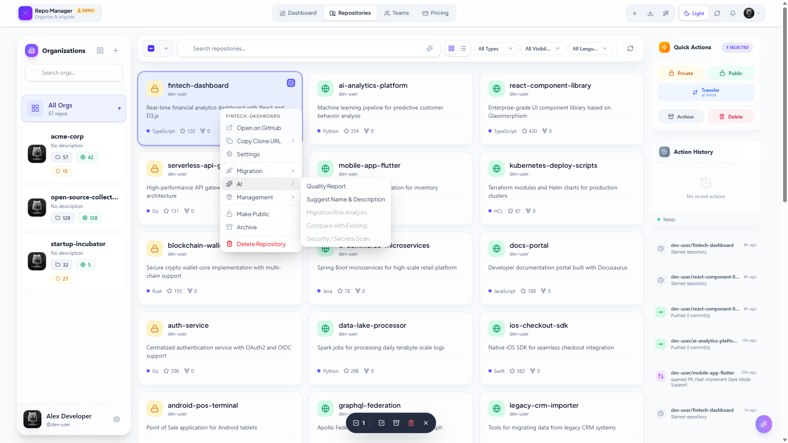
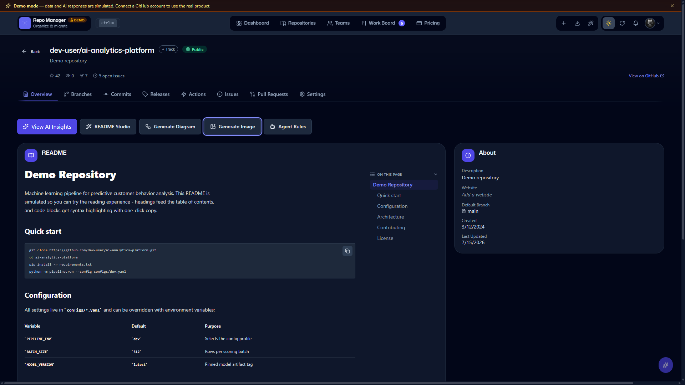
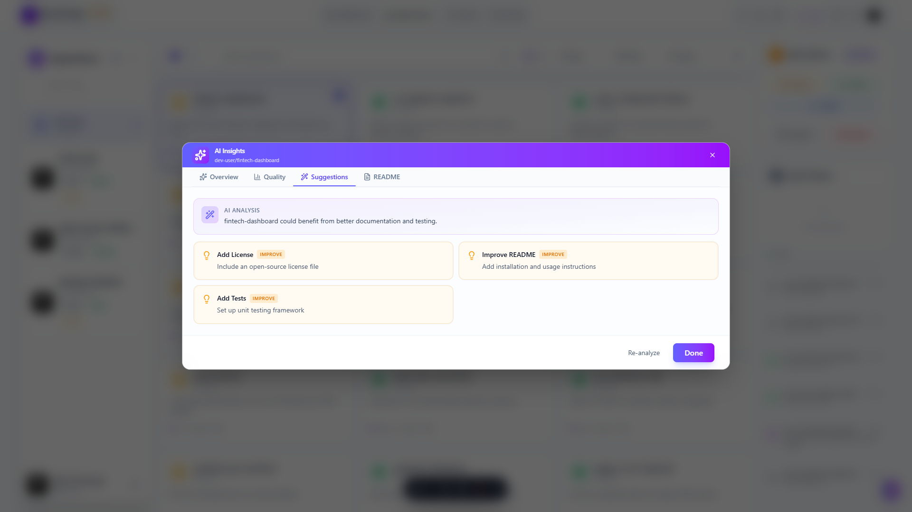
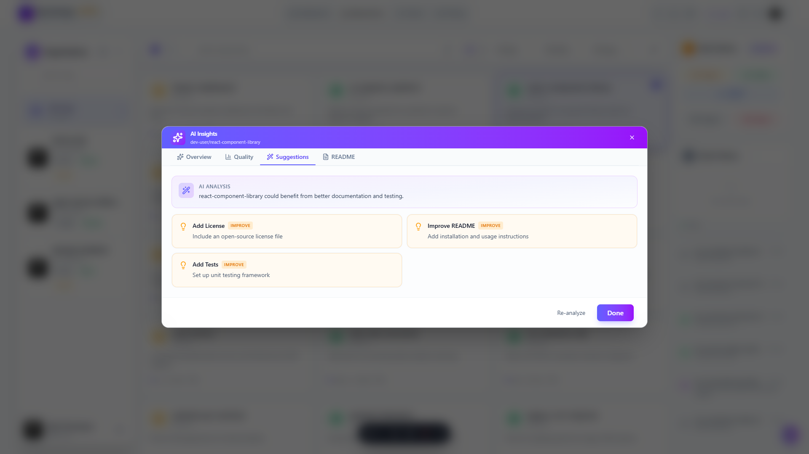

# Community WOW — README Studio, AI Diagrams, Agent Rules, Security Posture

> **Spec:** [`docs/specs/2026-07-18-community-wow-wave6.md`](../specs/2026-07-18-community-wow-wave6.md)
> **Plan:** [`docs/plans/2026-07-17-production-premium-plan.md`](../plans/2026-07-17-production-premium-plan.md) (Wave 6)
> **API reference:** [README Studio](../api/API.md#readme-studio), [Agent Rules Generator](../api/API.md#agent-rules-generator), [Security Posture](../api/API.md#security-posture), and the diagram/image routes under [AI](../api/API.md#ai-apiai)

Four AI-grounded repo tools shipped together in Wave 6 ("Community WOW"),
reachable from the repo Overview tab's AI submenu. All four are metered on
the Free tier with generous monthly caps (see
[Plans & Pricing](../../README.md#plans--pricing)) and every one degrades to
a zero-AI-cost deterministic fallback rather than hard-blocking when no AI
provider is configured, a provider call fails, or the quota is exhausted.

## README Studio

A free, deterministic README quality score — license correctness,
badge/reality consistency, install-vs-stack match, screenshots, and section
order — paired with a grounded, quota-gated "improve" flow that never
invents license claims, commands, or badges it can't verify from the repo's
actual signals (manifest, entrypoints, folder structure, topics, language,
LICENSE). Improve results always render as a diff before you can apply or
open a PR.

- `GET /api/repos/:owner/:repo/readme-studio/score` — free, no quota.
- `POST /api/ai/readme-studio/improve` — 25/month on Free (shares the
  existing README Generator cap), Unlimited on Pro/Enterprise.
- `POST /api/ai/readme-studio/improve/deterministic` — zero-AI-cost License/
  Install/TOC patch, offered automatically whenever the AI call above is
  unavailable.

## AI Diagram Generator

Generates an architecture diagram (Mermaid) grounded in the repo's real
top-level file tree and README — not a generic template. If the generated
Mermaid fails to render, the client automatically retries once with the
parse error fed back for self-repair; if it still fails, a deterministic
`flowchart TD` of the directory structure is offered instead. Diagrams can
be embedded directly into the repo as an idempotent README Mermaid fence
(regenerating replaces it in place) or as a sanitized SVG file under
`docs/diagrams/`, always through a preview-then-commit round trip.

- `POST /api/ai/generate-diagram` — 15/month on Free, Unlimited on
  Pro/Enterprise.
- `POST /api/ai/generate-diagram/deterministic` — free fallback.
- `POST /api/ai/generate-diagram/embed-preview` + `/embed-commit` — no AI
  call, plain preview/write actions.

## Agent Rules Generator

Generates AGENTS.md and/or CLAUDE.md content grounded in real detected
build/test/lint/CI signals (package.json scripts, lockfile family, test
directories, lint configs, workflow job names, LICENSE) — it never
fabricates a command that wasn't actually detected in the repo. Refresh
mode is diff-aware: it feeds the existing file back and asks for
only-changed-sections. When no AI provider is configured, the call errors,
or the spend cap is hit, generation falls back to a deterministic template
filled directly from the detected signals rather than blocking — even a
quota-exceeded `429` still ships a usable result.

- `POST /api/repos/:owner/:repo/agent-rules/generate` — 20/month on Free,
  Unlimited on Pro/Enterprise; falls back to the deterministic template on
  any AI unavailability.
- `POST /api/repos/:owner/:repo/agent-rules/commit` — plain write action,
  one commit per target file.

## Security Posture Panel

Extends the existing alerts scan (secret scanning, code scanning,
Dependabot) with a 10-check deterministic report card: branch protection,
alert severity, secret scanning + push protection, Dependabot security
updates, code scanning, `SECURITY.md`, workflow token permissions, and org
2FA. Every admin-gated check renders `unknown` on a `403` — distinct from
`fail` — so a non-admin collaborator is never misinformed. Moved off the
Pro paywall to Free in the same 2026-07-18 rebalance as the other bulk/AI
features. An optional AI narrative summarizes the report card, fed only
whitelisted `id`/`label`/`status`/`severity` fields — never raw alert
bodies — and cached per check-result hash so re-opening the panel without a
posture change doesn't re-bill the provider.

- `GET /api/repos/:owner/:repo/security` — Free (moved off Pro
  2026-07-18).
- `POST /api/repos/:owner/:repo/security/summary` — 75/month on Free,
  Unlimited on Pro/Enterprise.

## AI Image Generation

Generates a repo banner, README hero image, or logo draft across three
fixed presets (`social` / `hero` / `logo`) with a grounded, content-safety-
constrained prompt — `promptExtras` only adds a short style/color hint, it
never replaces the underlying template. Availability is capability-gated
per configured provider (some providers/models can't generate images at
all); a refusal or an unpriced provider/model combo never burns quota.
Committing a generated image is binary-safe — the base64 PNG bytes pass
straight through to the GitHub Contents API rather than being re-encoded as
if they were UTF-8 text.

- `GET /api/ai/generate-image/capability` — free capability check.
- `POST /api/ai/generate-image` — 5/month on Free, Unlimited on
  Pro/Enterprise; charged only after a successful generation.
- `POST /api/ai/generate-image/commit` — plain write action to a
  server-derived `docs/images/<preset>.png` path.

## Demo mode

Driving the app in demo mode (`npm run dev:all`, no API keys) exercises
realistic mock branches for all four features: README Studio's score uses a
deterministic mock payload, and the Image Generator draws a canvas-based
placeholder with a visible "SIMULATED — demo mode" watermark so a mock run
can never be mistaken for genuine provider output. Diagram Generator and
Agent Rules Generator already degrade to their real deterministic fallbacks
in demo mode, same as when a genuine AI provider call fails.
