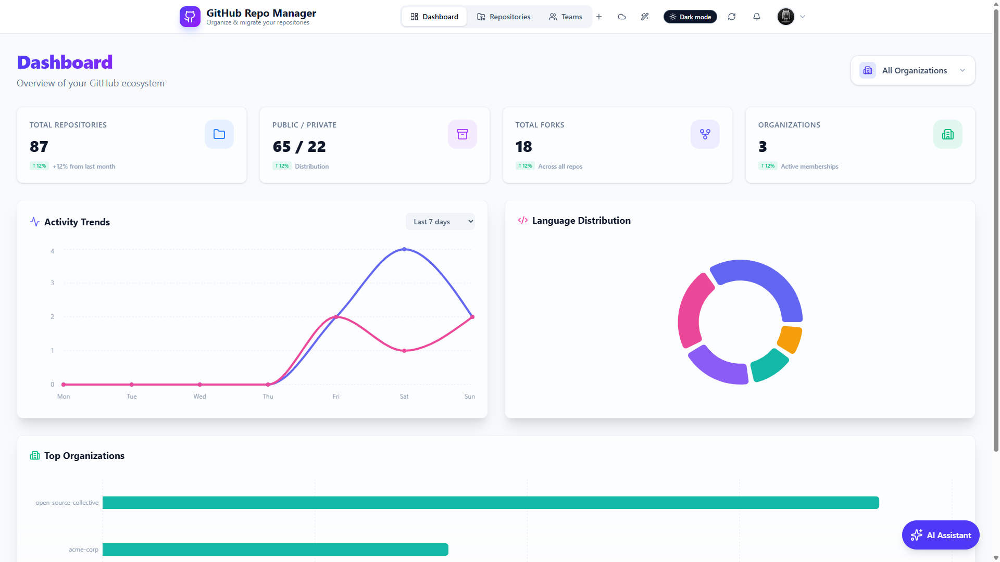
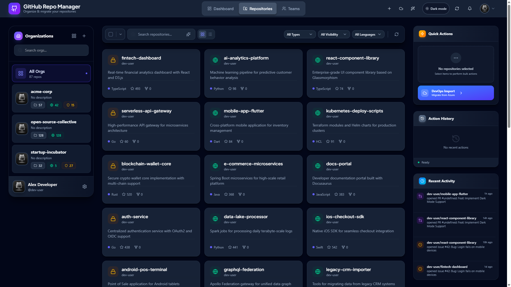
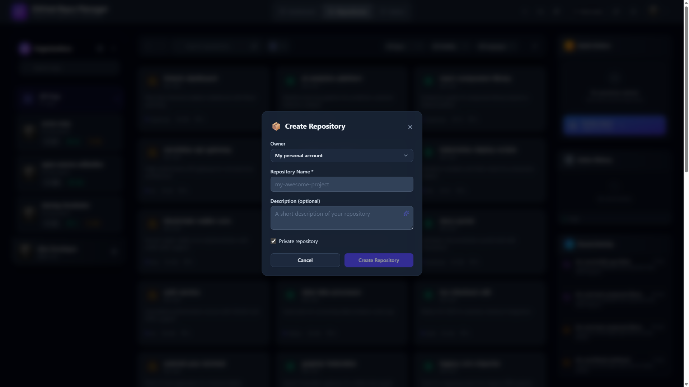
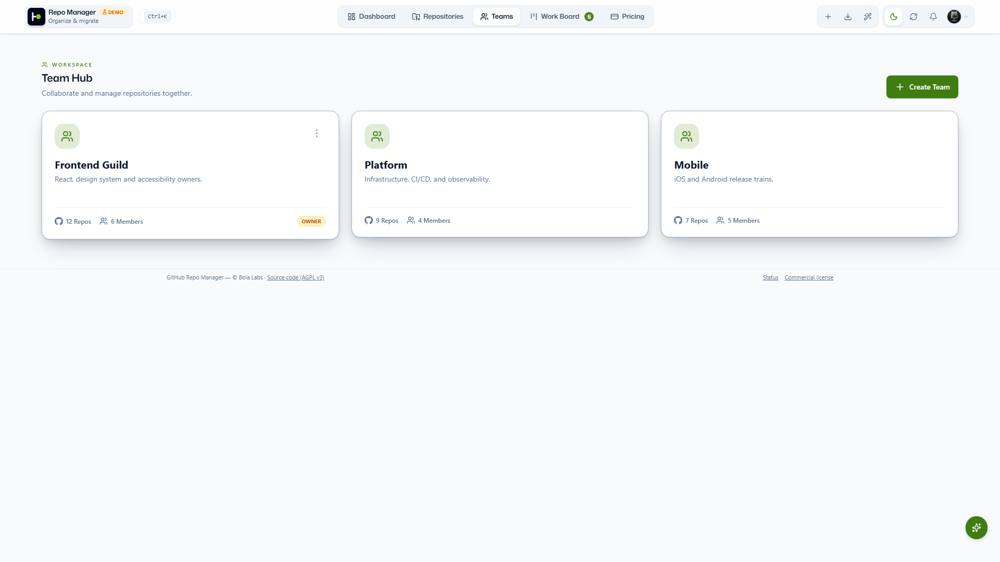
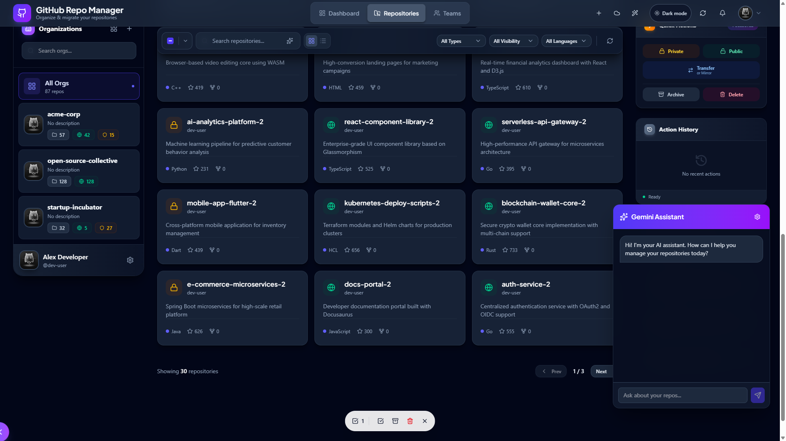

# Screenshots

Every capture is the real application running in mock mode at 1920×1080. Nothing is a mock-up. Views that ship in both themes are shown in both; both themes are gated for WCAG AA colour contrast in the e2e suite.

The architecture diagrams that appear in the README (`*.svg` in this folder) are generated, not drawn.

## Dashboard & Live Inbox

### Dashboard (light)

Time-of-day greeting, the "What needs you" KPI row, the Live Inbox and repository stats.

### Dashboard (dark)

The same view in the dark theme; both are gated for WCAG AA contrast in CI.

### Dashboard — full page

The complete dashboard scroll: overview, activity trends, language distribution, migrations and health.

### Live Inbox — Needs my review

Pull requests waiting on you, ranked, with AI one-liners.

### Live Inbox — My open PRs

Your own pull requests and their review state.

### Live Inbox — row expanded

A row opened inline: checks, reviewers and the next action.

### Live Inbox — snooze

Snooze an item until a date; state persists per user.

### Live Inbox — Stale drafts

Draft pull requests that have gone quiet.

### Live Inbox (dark)

The inbox in the dark theme.

### Live Inbox — mobile

The inbox at a 375 px viewport with the bottom tab bar.

## Repositories & Teams

### Repositories (light)

Organisation sidebar, search, type/visibility/language filters and the card grid.

### Repositories (dark)

Per-card language, stars, forks and open issues, with the Quick Actions rail.

### Create repository

The create dialog with AI-suggested name and description.

### Team Hub (light)

Teams, members and repository access in one place.

### Team Hub (dark)

Team cards with member avatars and activity.

## Work Board & keyboard

### Work Board (dark)

Cross-repo KPI tiles with sparklines and deltas, filter chips and the tab rail.

### Keyboard shortcuts

The registry-driven shortcuts dialog: g-chords, j/k row navigation, the palette.

### Command Palette

Ctrl+K: commands, repositories, pull requests and issues, plus "?" to ask.

### Work Board (light)

The Work Board in the light theme.

### Work Board — filters applied

Repository, author, label and age filters active, with a saved view.

## AI tools

### Repo Advisor

The floating AI assistant answering from your repositories, with grounded citations.

### AI actions menu

Every AI tool reachable from a repository, all metered.

### Repository overview

README reader with a table of contents, the About panel and the AI toolbar.

### AI Insights — Quality

Documentation, community, engineering and polish scores with recommendations.

### README Studio

A quality score ring with severity-tagged recommendations and "Improve with AI".

### AI Insights — Suggestions

Prioritised, grounded suggestions for the repository.

### AI Diagram Generator

A repo-aware architecture diagram rendered as Mermaid, ready to embed.

### AI Insights — Overview

A 72/100 health-score ring with a TL;DR, highlights and topic chips.

### AI Image Generator

A rendered social-preview card with a cost pill and Open PR / Apply actions.

### Agent Rules Generator

AGENTS.md / CLAUDE.md drafted from the repository's real build, test and CI signals.

### Suggest name & description

Field-by-field accept, edit or reject; a deterministic fallback without a key.

## Migration

### Migration Wizard

Azure DevOps to GitHub: source connection, repository selection with risk badges, dry-run and execute.

