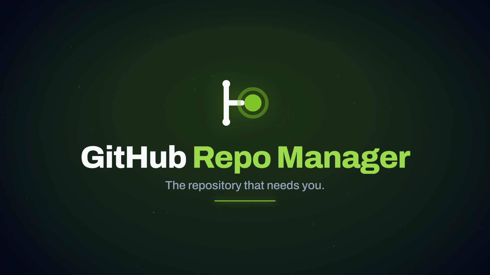

# Tour

The product in a minute, then the guide behind each scene. The film plays
on the [product page](https://bolalabs.pt/en/repomanager/) (muted loop in the
hero; one button restarts it with sound and captions). It is generated from
the captures in [`docs/images/`](screenshots.md), a synthesised score and a
neural narration, so it never shows anything the app does not do.

## Storyboard

| Scene | What you see | Narration | Read more |
| --- | --- | --- | --- |
| 1 · Title | The mark, the name, the line "The repository that needs you." | — | [Brand spec](BRAND.md) |
| 2 · The question | Dozens of repositories. Three notification systems. One question every morning: what needs me? | The problem, in the words a maintainer uses | [Why GitHub Repo Manager?](../README.md#why-github-repo-manager) |
| 3 · Dashboard |  | GitHub Repo Manager puts it on one dashboard. Reviews, stale pull requests, issues — for you, today. | [Dashboard & Live Inbox](../README.md#dashboard--live-inbox) |
| 4 · Quick actions |  | Every repository, one right-click away: details, migration, AI, visibility, archive. | [Repositories & Bulk](../README.md#repositories--bulk-operations) |
| 5 · Bulk operations | Thirty repositories selected; the batch bar: archive, transfer, migrate, visibility, export | Select thirty. Archive, transfer, migrate — one batch, previewed before it runs. | [Repositories & Bulk](../README.md#repositories--bulk-operations) |
| 6 · Work Board |  | See every repository at once, with DORA metrics built in. | [Cross-Repo Work Board](../README.md#cross-repo-work-board) |
| 7 · AI Deep Review | The split diff with risk per file, the walkthrough, the sequence diagram | AI Deep Review reads the diff, ranks the risk, draws the diagram — and publishes one review to GitHub. Your key. It never auto-commits. | [AI Deep Review](features/ai-deep-review.md) · [AI providers (BYOK)](ai-providers.md) |
| 8 · Migration |  | Leave Azure DevOps and TFVC, with a dry run first. | [Migration](../README.md#migration) |
| 9 · Close | The lockup, three facts (Free · Open source, Apache-2.0 · Native on Windows), the address | Free. Open source. Native on Windows. The repository that needs you. | [Installation](../README.md#installation) |

## Claims in the film, and where each one is enforced

- **One dashboard for reviews, stale PRs and issues** — the "What needs you" row and the Live Inbox on the dashboard (`src/components/Dashboard/`).
- **Quick actions on right-click** — `src/components/RepoContextMenu.jsx`: details, settings, GitHub, clone URL, migration, AI, management, visibility, archive, delete.
- **Bulk operations, previewed first** — the selection bar in `src/components/RepoList/`; every write goes through the same preview-first path as everything else.
- **AI Deep Review publishes one review** — risk per file, walkthrough and diagram in `src/components/PRReview/`; the publish step posts a single review to GitHub.
- **DORA metrics built in** — the Work Board's DORA tab, computed from GitHub data alone ([Work Board](../README.md#cross-repo-work-board)).
- **AI that cites** — grounded answers with citations; every AI route is metered through the spend cap ([AI providers](ai-providers.md)).
- **Your key** — BYOK is permanent; no plan sells managed inference ([pricing](../README.md#plans--pricing)).
- **It never auto-commits** — every write to a repository goes preview-first through `commitOrOpenPR()`; there is no other write primitive.
- **Dry run first** — the migration wizard's plan review step validates before anything is created ([migration features](../README.md#migration-features)).
- **Free, open source, Apache-2.0** — [`LICENSE`](../LICENSE); self-hosting is free forever.
- **Native on Windows** — installer and portable ZIP on every release ([Windows guide](windows.md)).

## Re-rendering

The film is produced from a local, gitignored workspace (`.dev/promo/` on the
development machine): a deterministic timeline stepped by Playwright, a Web
Audio score, Edge neural narration, ffmpeg assembly. When a capture used in a
scene is refreshed, re-render the film in the same change. Variants: 16:9,
1:1 and 9:16; English and Portuguese narration; WebVTT captions.
