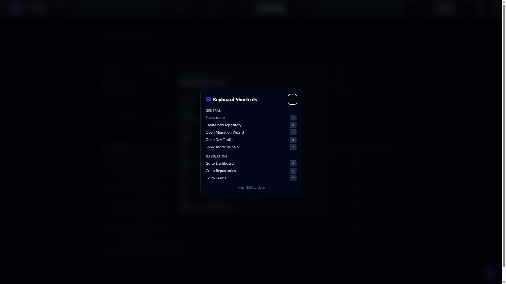

# Work Board

The Cross-Repo Work Board gives engineers and team leads a single view of all
review assignments, open issues, stale PRs, and DORA engineering metrics across
every tracked repository.

## What the Work Board shows

| Tab | Who can see it | Description |
|-----|---------------|-------------|
| **My Reviews** | Free+ | PRs where you are a requested reviewer and the review is still pending |
| **Stale PRs** | Pro+ | Open PRs that have not been merged or closed within a configurable threshold (default 7 days) |
| **My Issues** | Free+ | Open issues that are assigned to your GitHub login |
| **Review Load** | Pro+ | Per-reviewer submitted vs pending counts over the last 30 days — stacked-bar view to spot imbalanced review queues |
| **Tech Debt** | Pro+ | Open issues labelled `tech-debt`, `technical-debt`, `technical debt` (with space), `debt`, `refactor`, `refactoring`, `code-smell`, or `cleanup`, grouped by repo with hotspot ranking |
| **DORA** | Enterprise+ | Four-metric dashboard: deploy frequency, lead-time p50/p90, change failure rate, MTTR p50/p90 — plus CSV export |

## Pricing tier gating

| Feature | Free | Pro | Enterprise |
|---------|------|-----|------------|
| My Reviews | Yes | Yes | Yes |
| My Issues | Yes | Yes | Yes |
| Stale PRs | — | Yes | Yes |
| Review Load | — | Yes | Yes |
| Tech Debt | — | Yes | Yes |
| DORA — deploy frequency | — | — | Yes |
| DORA — lead time (p50/p90) | — | — | Yes |
| DORA — change failure rate | — | — | Yes |
| DORA — MTTR (p50/p90) | — | — | Yes |
| DORA — CSV export | — | — | Yes |

Users who attempt to access a higher-tier tab see an "Upgrade" card with a link
to the pricing page.

## How it works — the ingestion pipeline

The Work Board is powered by a three-layer pipeline:

```
GitHub webhooks
       │
       ▼
E1: Event ingestion  (server/routes/github-events-webhook.js)
       │  pr_events, issue_events, deployment_events, review_assignments
       ▼
E2: Aggregation queries  (server/lib/event-aggregations.js)
       │  listMyPendingReviews, listStalePRs, listMyOpenIssues,
       │  deployFrequency, leadTimeForChanges, reviewLoadByReviewer
       ▼
E3: Work Board API + UI  (server/routes/work-board.js + src/components/WorkBoard/)
```

No data appears until at least one webhook delivery has been processed.

## API endpoints

All endpoints live under `/api/v1/work-board/` and require an authenticated
session.

| Method | Path | Tier | Notes |
|--------|------|------|-------|
| GET | `/my-reviews` | Free+ | `?limit=N` |
| GET | `/my-issues` | Free+ | `?limit=N` |
| GET | `/stale-prs` | Pro+ | `?staleAfterDays=7&repoIds=1,2,3&limit=50` |
| GET | `/review-load` | Pro+ | `?since=ISO&repoIds=…` |
| GET | `/deploy-freq` | Enterprise+ | `?environment=production&since=ISO&repoIds=…` |
| GET | `/lead-time` | Enterprise+ | `?since=ISO&repoIds=…` |

## Webhook setup

To start populating the Work Board, register a GitHub webhook for each
organisation or repository you want to track:

1. Go to **Settings → Webhooks** in your GitHub organisation.
2. Set the Payload URL to `https://<your-host>/api/v1/webhooks/github`.
3. Set Content type to `application/json`.
4. Set the **Secret** to the value of your `WEBHOOK_SECRET` environment variable.
5. Select **individual events**: `Pull requests`, `Pull request reviews`,
   `Issues`, `Deployments`, `Deployment statuses`.

See also: `docs/event-ingestion.md` for the full ingestion reference.

## Zero-config data source

As of the Work Board mega-upgrade the board no longer requires a webhook to
show data. Each read endpoint picks the best source it can find, in this
priority order: fresh 5-minute cache → webhook aggregation (when non-empty)
→ live GitHub Search. Live results are merged into the same response shape
as webhook results so the UI code is source-agnostic.

### Per-endpoint source policy

| Endpoint | Source order |
|----------|--------------|
| `/my-reviews` | fresh cache → webhook non-empty (merged) → live (`review-requested:@me is:open is:pr`) |
| `/my-issues` | same, query `assignee:@me is:open is:issue` |
| `/stale-prs` | same, query `author:@me is:open is:pr updated:<cutoff` (skipped when `repoIds` is set) |
| `/tech-debt` | same, query `is:open is:issue (label:"tech-debt" OR label:"refactor" OR …)` (skipped when `repoIds` is set) |
| `/review-load` | webhook-only (requires deduplicated event history) |
| `/dora` family (`/deploy-freq`, `/lead-time`, `/change-failure-rate`, `/mttr`) | webhook-only (DORA metrics need event dedup) |

### Cache + ETag

- `work_board_cache` stores serialised responses per `(user_id, query_type, query_hash)` with a 5-minute TTL (`expires_at`).
- ETag revalidation is handled internally by `server/lib/githubApi.js` — there is no app-level ETag plumbing for callers to worry about.
- The background sweeper (below) reclaims expired rows.

### Response envelope

Every Work Board read endpoint returns the same envelope:

```json
{
  "data": [ /* rows */ ],
  "meta": {
    "source": "cache | webhook | live",
    "fetchedAt": "2026-04-20T10:15:03.421Z",
    "cacheExpiresAt": "2026-04-20T10:20:03.421Z",
    "liveFetchError": null,
    "liveSkipReason": null,
    "requiresWebhook": false
  }
}
```

- `requiresWebhook: true` is returned when the caller hits a webhook-only
  endpoint (Review Load, DORA) with no ingested events yet.
- `liveSkipReason` is set (e.g. `"repoIds filter"`) when the fallback was
  skipped for a structural reason rather than a network failure.
- `liveFetchError` captures the underlying GitHub error message when a live
  call was attempted and failed.

## Auto-refresh

- 60-second polling by default. The `WorkBoard` hook family reads
  `refreshIntervalMs` — set to `0` to disable polling entirely.
- Page Visibility API: polling pauses when the tab is hidden and fires an
  immediate re-fetch on re-visibility, so dashboards left open overnight
  don't pound GitHub.
- Manual refresh via the **Refresh** button in the page header.
- The "Updated N s ago" indicator shows the *oldest* `lastFetchedAt` across
  the four KPI hooks, so the number reflects the staleness of the slowest
  lane.

## Filters, URL sync, and presets

The filter bar above the tab list supports:

- **Repo** — multi-select across tracked repositories.
- **Author** — multi-select across GitHub logins seen in the current data.
- **Label** — multi-select across issue/PR labels.
- **Age bucket** — single-select `24h` / `7d` / `30d`.
- **Hide snoozed** — toggle; when enabled, the active tab omits snoozed
  rows client-side (in addition to the server-side filter; see below).

Active filters are serialised to the URL so a page is shareable / bookmarkable:

```
/work-board?tab=stale-prs&repos=org%2Fapi,org%2Fweb&authors=alice,bob&labels=bug&age=7d&snoozed=hidden
```

### Presets

Filter presets are stored server-side in the `work_board_presets` table
(cross-device). `PresetDropdown` in the filter bar manages CRUD:

| Method | Path |
|--------|------|
| GET | `/api/v1/work-board/presets` |
| POST | `/api/v1/work-board/presets` |
| PATCH | `/api/v1/work-board/presets/:id` |
| DELETE | `/api/v1/work-board/presets/:id` |

Creating a preset with an already-used name returns
`409 { code: 'preset_exists' }`; the UI surfaces this as a readable
"A preset with that name already exists" message instead of a raw 409.

## Snooze

PRs and issues can be snoozed per user, stored in `work_board_snooze`
(keyed on `repo_full_name`, `item_number`, `item_type`, `until_at`).
Because state lives server-side the snooze follows the user across
devices and sessions.

| Method | Path |
|--------|------|
| POST | `/api/v1/work-board/snooze` |
| DELETE | `/api/v1/work-board/snooze` |
| GET | `/api/v1/work-board/snoozes` |

Supported snooze durations (hours): **1 / 4 / 8 / 24 / 72 / 168 / 720**.

Snoozed rows are filtered out of every read endpoint by default. Send
`?includeSnoozed=1` to override (used by the "Show snoozed" toggle on
the filter bar).

## Keyboard shortcuts



The `?` help modal (`src/components/WorkBoard/KeyboardHelpModal.jsx`)
documents the full keyboard surface:

| Key | Action |
|-----|--------|
| `j` / `↓` | Next row |
| `k` / `↑` | Previous row |
| Click a tab | Switch section (tabs are URL-synced via `?tab=<id>`; ⌘K command palette also lists every tab) |
| `Enter` | Open the active row on GitHub |
| `.` | Approve the active PR |
| `x` | Request changes on the active PR (requires body) |
| `s` | Snooze active row for 24 h |
| `Shift+S` | Snooze active row for 7 days |
| `u` | Unsnooze active row |
| `r` | Re-request review on the active PR |
| `/` | Focus the filter search input (when present) |
| `?` | Open this keyboard help modal |
| `⌘K` / `Ctrl+K` | Open the command palette |

> A `g`-prefix tab chord was considered but `g` is already bound globally to "Open Dev Toolkit" in `useKeyboardShortcuts`. Tabs remain fully accessible via click, URL, and the palette.

## Inline actions and `scope_required`

`POST /api/v1/work-board/review-action`

```json
{
  "repoFullName": "org/api",
  "prNumber": 1234,
  "action": "approve | request_changes | comment",
  "body": "Optional for approve; required for request_changes / comment"
}
```

- `action: "request_changes"` and `action: "comment"` require a non-empty
  `body` — the server returns 400 otherwise.
- When GitHub responds with 403 (token lacks the `repo` scope needed to
  submit reviews), the endpoint returns `403 { code: 'scope_required' }`.
  The UI renders this as a "Re-authorize with `repo` scope to approve PRs"
  prompt linking to the OAuth re-consent flow, rather than a generic error.

## AI summary (BYOK)

`POST /api/v1/work-board/ai-summary`

Returns a structured digest of the current board:

```json
{
  "data": {
    "headline": "2 PRs blocking release, 3 tech-debt items growing",
    "bullets": [
      "Review backlog on org/api: 4 PRs > 5 days",
      "Deploy frequency dropped 30% vs last week"
    ],
    "urgencyScore": 72,
    "model": "claude-opus-4-5",
    "provider": "anthropic"
  },
  "meta": {
    "cached": false,
    "generatedAt": "2026-04-20T10:15:03.421Z"
  }
}
```

- **BYOK-gated.** Without a configured provider the endpoint returns
  `404 { code: 'ai_not_configured' }` and the UI silently hides the card —
  no upsell, no error toast.
- **Supported providers:** Anthropic, OpenAI, Gemini, OpenRouter, and Local
  (LMStudio / Ollama).
- **Cooldown + cache.** A 5-minute per-user cooldown is enforced, and
  results are cached for 5 minutes in `work_board_cache` under
  `query_type = 'ai_summary'`.
- **Prompt + schema.** `server/lib/work-board-summary.js` exports
  `SYSTEM_PROMPT` and `SUMMARY_SCHEMA` — the system prompt is stable across
  calls to make future Anthropic `cache_control` wiring a drop-in.

## Command palette integration

When `activeView === 'work-board'`, the global command palette (`⌘K` /
`Ctrl+K`) surfaces a **Work Board** group containing:

- Six navigate-to-tab entries (Reviews / Stale PRs / My Issues / Review
  Load / Tech Debt / DORA).
- **Regenerate AI summary** — calls the AI summary endpoint bypassing the
  cache (subject to the 5-minute cooldown).
- **Save current filters as preset** — opens the preset-name prompt
  pre-filled with the current filter set.

## Background sweeper

`server/lib/work-board-sweeper.js` runs every 10 minutes (`timer.unref()`ed
so it doesn't keep the process alive during tests, and the start function
is idempotent so it's safe to import from multiple entry points). It:

- Deletes `work_board_cache` rows where `expires_at < NOW - 1 day`.
- Deletes `work_board_snooze` rows where `until_at < NOW - 1 day`.

## MOCK_MODE

When `VITE_MOCK_MODE=true` (the default in demo mode) the Work Board renders
with synthetic data — 5 pending reviews, 10 stale PRs, sample DORA metrics —
without making any backend calls. This lets the UI render in a demo environment.
